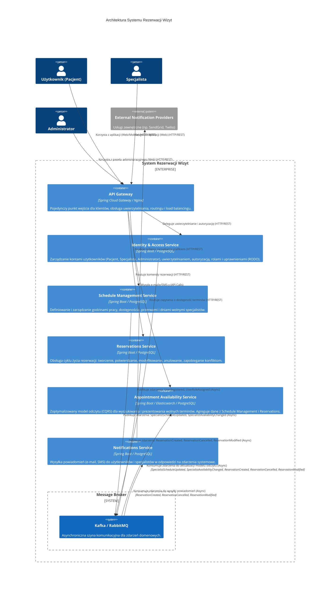

# 1. Analiza Domen i Encji

Jako doświadczony architekt oprogramowania, analizując dostarczone wymagania, zidentyfikowałem następujące główne Domena (Bounded Contexts) oraz kluczowe Encje Domenowe. Przyjąłem podejście Domain-Driven Design (DDD), aby zapewnić spójność i niezależność kontekstów.

---

### Analiza Wymagań i Identyfikacja Domen

**Kluczowe obserwacje:**

1.  **Różne Role:** Mamy trzy główne role: Użytkownik (Pacjent), Specjalista, Administrator, co sugeruje potrzebę kontekstu zarządzania tożsamością i uprawnieniami.
2.  **Zarządzanie Czasem:** Specjaliści zarządzają *swoim* grafikiem, a użytkownicy rezerwują *dostępne* terminy. Są to dwie strony tego samego medalu, ale z różnymi perspektywami i operacjami.
3.  **Transakcyjność Rezerwacji:** Rezerwacja to kluczowa transakcja, która blokuje termin i ma swój cykl życia (potwierdzenie, anulowanie, modyfikacja).
4.  **Wyszukiwanie Dostępności:** Wyszukiwanie wolnych terminów to operacja, która musi być wydajna (NFR2) i prezentować zagregowany widok.
5.  **Powiadomienia:** Zmiany statusów rezerwacji i grafików wymagają wysyłania powiadomień.
6.  **Wymagania Niefunkcjonalne (NFRs):** Skalowalność (NFR1), wydajność wyszukiwania (NFR2) i wysoka dostępność (NFR3) sugerują potrzebę rozdzielenia na mikroserwisy lub przynajmniej luźno powiązane konteksty. Bezpieczeństwo danych (NFR4 - RODO) jest kluczowe dla danych osobowych i medycznych.

---

### Zidentyfikowane Domeny (Bounded Contexts) i Kluczowe Encje

Na podstawie powyższej analizy, proponuję następujące Bounded Contexts:

#### 1. Tożsamość i Dostęp (Identity & Access)

*   **Cel:** Zarządzanie kontami użytkowników, uwierzytelnianiem, autoryzacją oraz rolami w systemie. Zapewnia bezpieczeństwo i kontrolę dostępu.
*   **Responsywność:**
    *   Rejestracja i logowanie użytkowników (Pacjent, Specjalista, Administrator).
    *   Zarządzanie profilami użytkowników (dane kontaktowe, dane osobowe z uwzględnieniem RODO).
    *   Przydzielanie i zarządzanie rolami oraz uprawnieniami (US6, AC6).
    *   Uwierzytelnianie i autoryzacja żądań.
*   **Kluczowe Encje Domenowe:**
    *   **`Użytkownik`**: Podstawowa encja reprezentująca osobę korzystającą z systemu. Zawiera dane uwierzytelniające, dane kontaktowe i unikalny identyfikator.
    *   **`Rola`**: Definiuje zbiór uprawnień (np. "Pacjent", "Specjalista", "Administrator").
    *   **`Uprawnienie`**: Granularne prawa do wykonania konkretnych akcji w systemie (np. `rezerwuj_termin`, `edytuj_grafik`).

#### 2. Zarządzanie Grafikiem (Schedule Management)

*   **Cel:** Umożliwienie specjalistom definiowania i zarządzania swoimi godzinami pracy i dostępnością. Jest to "źródło prawdy" dla potencjalnej dostępności specjalisty.
*   **Responsywność:**
    *   Tworzenie, edycja i usuwanie bloków dostępności specjalisty (US4, AC4).
    *   Definiowanie przerw, dni wolnych, urlopów.
    *   Zarządzanie lokalizacjami pracy specjalisty (jeśli dotyczy).
*   **Kluczowe Encje Domenowe:**
    *   **`Specjalista`**: Reprezentacja specjalisty w kontekście jego grafiku. Zawiera ID powiązane z `Użytkownikiem` oraz specyficzne dane (np. specjalizacja, czas trwania domyślnej wizyty).
    *   **`GrafikSpecjalisty`**: Agregat zawierający wszystkie bloki dostępności dla danego specjalisty.
    *   **`BlokDostępności`**: Konkretny przedział czasu, w którym specjalista jest dostępny do pracy (np. "poniedziałek, 9:00-17:00"). Może zawierać typ (praca, przerwa, wolne).

#### 3. Dostępność Terminów (Appointment Availability)

*   **Cel:** Prezentowanie użytkownikom aktualnej, zagregowanej i zoptymalizowanej pod kątem wyszukiwania listy wolnych terminów, bazując na grafiku specjalistów i istniejących rezerwacjach.
*   **Responsywność:**
    *   Wyszukiwanie dostępnych terminów dla danego specjalisty lub specjalizacji (US1, AC1, NFR2).
    *   Agregacja danych z `Zarządzania Grafikiem` i `Rezerwacji` w czasie rzeczywistym.
    *   Filtrowanie i sortowanie terminów.
*   **Kluczowe Encje Domenowe:**
    *   **`Specjalista`**: Lżejsza reprezentacja specjalisty, wystarczająca do wyświetlenia w kontekście wyszukiwania (ID, imię, specjalizacja).
    *   **`TerminDostępności`**: Obiekt reprezentujący pojedynczy, wolny slot czasowy, który może zostać zarezerwowany. Jest to stan wyliczeniowy, a nie trwały obiekt.
    *   **`Usługa`** (opcjonalnie): Jeśli specjaliści oferują różne usługi o różnym czasie trwania (np. "konsultacja 30 min", "zabieg 60 min").

#### 4. Rezerwacje (Reservations)

*   **Cel:** Obsługa cyklu życia rezerwacji: tworzenie, potwierdzanie, modyfikowanie i anulowanie. Zarządzanie transakcyjnym procesem blokowania terminów.
*   **Responsywność:**
    *   Dokonywanie rezerwacji wybranych terminów (US2, AC2).
    *   Anulowanie rezerwacji (US3, AC3).
    *   Modyfikacja istniejących rezerwacji przez specjalistę (US5, AC5).
    *   Zapobieganie konfliktom rezerwacji na tym samym terminie (AC2).
    *   Zarządzanie statusami rezerwacji (np. "Potwierdzona", "Anulowana", "Zmieniona").
*   **Kluczowe Encje Domenowe:**
    *   **`Rezerwacja`**: Główny agregat. Reprezentuje potwierdzoną wizytę.
        *   Zawiera: ID rezerwacji, ID pacjenta, ID specjalisty, data i czas wizyty, czas trwania, status rezerwacji.
    *   **`Pacjent`**: Lżejsza reprezentacja pacjenta w kontekście rezerwacji (ID powiązane z `Użytkownikiem`).
    *   **`Specjalista`**: Lżejsza reprezentacja specjalisty w kontekście rezerwacji (ID powiązane z `Użytkownikiem`).
    *   **`TerminWizyty`**: Konkretny przedział czasowy, który został zarezerwowany.

#### 5. Powiadomienia (Notifications)

*   **Cel:** Obsługa wysyłki wszelkich powiadomień do użytkowników i specjalistów (e-mail, SMS itp.) w odpowiedzi na zdarzenia w innych kontekstach.
*   **Responsywność:**
    *   Wysyłanie potwierdzeń rezerwacji (AC2).
    *   Wysyłanie powiadomień o anulowaniu.
    *   Wysyłanie powiadomień o zmianie terminu wizyty (AC5).
    *   Obsługa szablonów powiadomień.
*   **Kluczowe Encje Domenowe:**
    *   **`Powiadomienie`**: Agregat reprezentujący wiadomość do wysłania. Zawiera treść, adresata, kanał wysyłki (e-mail, SMS) i status wysyłki.
    *   **`SzablonPowiadomienia`**: Definiuje strukturę i treść różnych typów powiadomień.
    *   **`AdresatPowiadomienia`**: Dane kontaktowe do wysyłki (e-mail, numer telefonu), powiązane z ID `Użytkownika`.

---

### Relacje i Przepływy Między Kontekstami (Wysoki Poziom)

*   `Tożsamość i Dostęp` jest upstream dla wszystkich innych kontekstów, dostarczając informacje o `Użytkownikach`, `Rolach` i `Uprawnieniach`.
*   `Zarządzanie Grafikiem` publikuje zdarzenia (np. "GrafikSpecjalistyZmieniony"), które są konsumowane przez `Dostępność Terminów` w celu aktualizacji widoku dostępnych slotów.
*   `Rezerwacje` odwołuje się do `Specjalisty` i `Pacjenta` (poprzez ich ID) z kontekstu `Tożsamość i Dostęp`.
*   `Rezerwacje` publikuje zdarzenia (np. "RezerwacjaUtworzona", "RezerwacjaAnulowana", "RezerwacjaZmieniona"), które są konsumowane przez:
    *   `Dostępność Terminów` w celu aktualizacji wolnych slotów.
    *   `Powiadomienia` w celu wysłania odpowiednich wiadomości.
*   `Dostępność Terminów` jest czytnikiem, który łączy dane z `Zarządzania Grafikiem` i `Rezerwacji`, aby prezentować aktualny stan wolnych slotów.

Taka architektura, oparta na Bounded Contexts, pozwoli na niezależne rozwijanie, skalowanie i wdrażanie poszczególnych komponentów, jednocześnie zapewniając spójność domenową i elastyczność w reagowaniu na zmieniające się wymagania biznesowe.

---

# 2. Zaproponowana Architektura

Na podstawie dostarczonej analizy domen i zidentyfikowanych wymagań funkcjonalnych oraz niefunkcjonalnych (NFRs), proponuję architekturę systemu opartą na **Mikroserwisach (Microservices)** z wykorzystaniem **Architektury Zorientowanej na Zdarzenia (Event-Driven Architecture - EDA)** oraz wzorca **CQRS (Command Query Responsibility Segregation)** w kluczowym kontekście `Dostępność Terminów`.

---

### 1. Wybór Konkretnych Wzorców Architektonicznych i Uzasadnienie

**Wzorce Architektoniczne:**

1.  **Mikroserwisy (Microservices):**
    *   **Uzasadnienie:**
        *   **Izolacja Domen:** Zidentyfikowane Bounded Contexts (Tożsamość i Dostęp, Zarządzanie Grafikiem, Dostępność Terminów, Rezerwacje, Powiadomienia) naturalnie mapują się na niezależne mikroserwisy. Każdy mikroserwis będzie odpowiedzialny za jeden kontekst domenowy, posiadając własną bazę danych i logikę biznesową.
        *   **Skalowalność (NFR1):** Niezależne skalowanie każdego serwisu. Konteksty o różnym obciążeniu (np. `Dostępność Terminów` dla wyszukiwania vs. `Zarządzanie Grafikiem` dla rzadszych operacji specjalistów) mogą być skalowane oddzielnie, optymalizując zasoby.
        *   **Wysoka Dostępność (NFR3):** Izolacja awarii. Błąd w jednym serwisie nie wpływa bezpośrednio na działanie innych.
        *   **Niezależne Wdrażanie:** Umożliwia zespołom niezależne rozwijanie, testowanie i wdrażanie każdego serwisu, co przyspiesza cykl deweloperski.
        *   **Elastyczność Technologiczna:** Pozwala na użycie różnych technologii i języków programowania dla poszczególnych serwisów, jeśli jest to uzasadnione (np. baza danych zoptymalizowana pod wyszukiwanie dla `Dostępność Terminów`).

2.  **Architektura Zorientowana na Zdarzenia (Event-Driven Architecture - EDA):**
    *   **Uzasadnienie:**
        *   **Luźne Powiązanie (Loose Coupling):** Serwisy komunikują się ze sobą poprzez publikowanie i subskrybowanie zdarzeń, zamiast bezpośrednich wywołań. To zmniejsza zależności i zwiększa odporność systemu na zmiany.
        *   **Reaktywność:** Zmiany w jednym kontekście (np. nowa rezerwacja) mogą automatycznie wyzwalać akcje w innych (np. wysłanie powiadomienia, aktualizacja dostępności).
        *   **Wymagania Powiadomień:** Serwis `Powiadomienia` jest klasycznym przykładem konsumenta zdarzeń, reagującego na zmiany statusów rezerwacji czy grafików.
        *   **Aktualizacja Widoków (CQRS):** Niezbędne dla kontekstu `Dostępność Terminów`, aby na bieżąco aktualizować swój model odczytu w oparciu o zdarzenia z `Zarządzania Grafikiem` i `Rezerwacji`.

3.  **CQRS (Command Query Responsibility Segregation) dla `Dostępność Terminów`:**
    *   **Uzasadnienie:**
        *   **Wydajność Wyszukiwania (NFR2):** `Dostępność Terminów` ma za zadanie efektywne wyszukiwanie i prezentowanie zagregowanych danych. Oddzielenie modelu zapisu (np. `Rezerwacje`, `Zarządzanie Grafikiem`) od modelu odczytu pozwala na optymalizację tego drugiego pod kątem zapytań.
        *   **Złożoność Domeny:** Model zapisu dla rezerwacji i zarządzania grafikiem jest transakcyjny i skupia się na spójności danych. Model odczytu (`Dostępność Terminów`) wymaga denormalizacji i agregacji danych z wielu źródeł w celu szybkiego odpowiadania na złożone zapytania użytkownika (np. "znajdź wolne terminy dla specjalistów X i Y w danej specjalizacji").
        *   **Niezależne Skalowanie:** Model odczytu może być skalowany niezależnie od modeli zapisu, co jest kluczowe dla wydajności wyszukiwania przy dużym obciążeniu.

4.  **API Gateway:**
    *   **Uzasadnienie:** Zapewnia pojedynczy punkt wejścia dla aplikacji klienckich, co upraszcza architekturę po stronie klienta. Obsługuje uwierzytelnianie (delegując do `Identity & Access`), autoryzację, routing żądań do odpowiednich mikroserwisów, i potencjalnie agregację odpowiedzi.

---

### 2. Proponowane Komponenty/Serwisy, Odpowiedzialności i Komunikacja

Każdy zidentyfikowany Bounded Context zostanie zaimplementowany jako osobny mikroserwis.

1.  **API Gateway**
    *   **Odpowiedzialności:**
        *   Jednolity punkt dostępu dla aplikacji klienckich (Web, Mobile).
        *   Uwierzytelnianie i autoryzacja żądań (poprzez współpracę z `Identity & Access Service`).
        *   Routing żądań do odpowiednich mikroserwisów.
        *   Load Balancing i zabezpieczenia (np. Rate Limiting).
        *   Agregacja odpowiedzi (opcjonalnie, dla złożonych widoków UI).
    *   **Sposób Komunikacji:** HTTP/REST z klientami; HTTP/REST z wewnętrznymi serwisami.

2.  **Identity & Access Service**
    *   **Odpowiedzialności:**
        *   Rejestracja i logowanie użytkowników (Pacjent, Specjalista, Administrator).
        *   Zarządzanie profilami użytkowników (dane osobowe, kontaktowe).
        *   Zarządzanie rolami i uprawnieniami (US6, AC6).
        *   Wydawanie i walidacja tokenów uwierzytelniających (np. JWT).
        *   Obsługa polityki RODO dla danych użytkowników (NFR4).
    *   **Sposób Komunikacji:**
        *   HTTP/REST (Command/Query): Z `API Gateway` do operacji na użytkownikach, uwierzytelniania.
        *   Publikacja Zdarzeń (Asynchronicznie, przez Message Broker): `UserRegistered`, `UserRoleAssigned`.

3.  **Schedule Management Service**
    *   **Odpowiedzialności:**
        *   Tworzenie, edycja i usuwanie bloków dostępności specjalisty (US4, AC4).
        *   Definiowanie przerw, dni wolnych, urlopów dla specjalisty.
        *   Zarządzanie szczegółami specjalisty (specjalizacja, czas trwania domyślnej wizyty).
        *   Jest "źródłem prawdy" dla grafiku pracy specjalisty.
    *   **Sposób Komunikacji:**
        *   HTTP/REST (Command/Query): Z `API Gateway` dla operacji zarządzania grafikiem.
        *   Publikacja Zdarzeń (Asynchronicznie, przez Message Broker): `SpecialistScheduleUpdated`, `SpecialistAvailabilityChanged`.

4.  **Reservations Service**
    *   **Odpowiedzialności:**
        *   Tworzenie, anulowanie (US3, AC3), modyfikacja (US5, AC5) rezerwacji.
        *   Zapobieganie konfliktom rezerwacji na tym samym terminie (AC2).
        *   Zarządzanie cyklem życia i statusami rezerwacji (Potwierdzona, Anulowana, Zmieniona).
        *   Gwarantowanie transakcyjności i spójności danych rezerwacji.
    *   **Sposób Komunikacji:**
        *   HTTP/REST (Command): Z `API Gateway` do wykonywania operacji na rezerwacjach (np. `POST /reservations`, `PUT /reservations/{id}/cancel`).
        *   Publikacja Zdarzeń (Asynchronicznie, przez Message Broker): `ReservationCreated`, `ReservationCancelled`, `ReservationModified`.

5.  **Appointment Availability Service (CQRS Read Model)**
    *   **Odpowiedzialności:**
        *   Agregacja danych z `Schedule Management` i `Reservations` w celu zbudowania zoptymalizowanego widoku dostępnych terminów (US1, AC1, NFR2).
        *   Obsługa złożonych zapytań o dostępność (filtrowanie po specjalizacji, dacie, specjaliście).
        *   Prezentowanie aktualnego stanu wolnych slotów.
    *   **Sposób Komunikacji:**
        *   HTTP/REST (Query): Z `API Gateway` do wyszukiwania terminów (np. `GET /available-appointments?specialization=XYZ`).
        *   Subskrypcja Zdarzeń (Asynchronicznie, przez Message Broker): `SpecialistScheduleUpdated`, `SpecialistAvailabilityChanged` (do aktualizacji bazowego grafiku), `ReservationCreated`, `ReservationCancelled`, `ReservationModified` (do aktualizacji zajętych slotów).

6.  **Notifications Service**
    *   **Odpowiedzialności:**
        *   Wysyłanie powiadomień (e-mail, SMS) do pacjentów i specjalistów.
        *   Obsługa szablonów powiadomień.
        *   Zarządzanie kolejką wysyłki i statusami dostarczenia powiadomień.
        *   Współpraca z zewnętrznymi dostawcami usług e-mail/SMS.
    *   **Sposób Komunikacji:**
        *   Subskrypcja Zdarzeń (Asynchronicznie, przez Message Broker): `ReservationCreated` (potwierdzenie rezerwacji - AC2), `ReservationCancelled` (powiadomienie o anulowaniu - AC3), `ReservationModified` (powiadomienie o zmianie - AC5), itp.
        *   Zewnętrzne API: Z dostawcami e-mail/SMS.

**Dodatkowe Komponenty Infrastruktury:**

*   **Message Broker (np. Apache Kafka, RabbitMQ):** Centralny element dla Event-Driven Architecture, umożliwiający asynchroniczną, niezawodną komunikację między mikroserwisami.
*   **Databases:** Każdy mikroserwis będzie posiadał własną bazę danych, niezależną od innych, aby zapewnić izolację i niezależność wdrożeniową. `Appointment Availability Service` może używać bazy danych zoptymalizowanej pod kątem zapytań (np. PostgreSQL z widokami zmaterializowanymi, Elasticsearch, MongoDB).

---

### 3. Mapowanie Wymagań na Komponenty

| Wymaganie                                             | Komponenty Realizujące                                                                 | Uzasadnienie                                                                                                                                                                                                                                      |
| :---------------------------------------------------- | :------------------------------------------------------------------------------------- | :------------------------------------------------------------------------------------------------------------------------------------------------------------------------------------------------------------------------------------------------ |
| **US1: Wyszukiwanie dostępnych terminów**             | `Appointment Availability Service`                                                     | Główna odpowiedzialność tego serwisu, wykorzystuje zoptymalizowany model odczytu.                                                                                                                                                                 |
| **AC1: Wyszukiwanie terminów dla specjalisty/spec.**  | `Appointment Availability Service`                                                     | Serwis ten agreguje i udostępnia dane w taki sposób, aby umożliwić elastyczne wyszukiwanie.                                                                                                                                                      |
| **NFR2: Wydajność wyszukiwania**                      | `Appointment Availability Service` (CQRS Read Model)                                   | Separacja od modelu zapisu i optymalizacja pod kątem zapytań (denormalizacja, indeksowanie).                                                                                                                                                      |
| **US2: Dokonywanie rezerwacji**                       | `Reservations Service`                                                                 | Centralna logika biznesowa dla procesu rezerwacji.                                                                                                                                                                                                |
| **AC2: Potwierdzenie rezerwacji (limit 3 rezerwacji)** | `Reservations Service` (walidacja), `Notifications Service` (wysyłka potwierdzenia) | `Reservations Service` będzie odpowiedzialny za logikę biznesową związaną z limitami rezerwacji na pacjenta. Po pomyślnej rezerwacji `Reservations Service` wyemituje zdarzenie, które `Notifications Service` skonsumuje do wysyłki potwierdzenia. |
| **AC2: Zapobieganie konfliktom rezerwacji**           | `Reservations Service`                                                                 | Kluczowa odpowiedzialność, zapewnienie atomowości i spójności transakcji rezerwacji.                                                                                                                                                              |
| **US3: Anulowanie rezerwacji**                        | `Reservations Service`                                                                 | Logika biznesowa anulowania rezerwacji.                                                                                                                                                                                                           |
| **AC3: Powiadomienia o anulowaniu**                   | `Notifications Service`                                                                | Konsumuje zdarzenie `ReservationCancelled` z `Reservations Service`.                                                                                                                                                                              |
| **US4: Tworzenie/edycja bloków dostępności**          | `Schedule Management Service`                                                          | Główna odpowiedzialność dla specjalistów zarządzających swoim grafikiem.                                                                                                                                                                         |
| **AC4: Zarządzanie grafikiem**                        | `Schedule Management Service`                                                          | Zapewnia pełen zestaw operacji CRUD na grafikach specjalistów.                                                                                                                                                                                     |
| **US5: Modyfikacja rezerwacji**                       | `Reservations Service`                                                                 | Logika biznesowa zmiany istniejącej rezerwacji.                                                                                                                                                                                                   |
| **AC5: Powiadomienia o zmianie terminu**              | `Notifications Service`                                                                | Konsumuje zdarzenie `ReservationModified` z `Reservations Service`.                                                                                                                                                                               |
| **US6: Rejestracja/Logowanie**                        | `Identity & Access Service`                                                            | Centralne zarządzanie tożsamością i sesjami użytkowników.                                                                                                                                                                                         |
| **AC6: Zarządzanie rolami/uprawnieniami**             | `Identity & Access Service`                                                            | Definiowanie i przypisywanie ról oraz uprawnień (np. "Specjalista" może edytować grafik).                                                                                                                                                          |
| **NFR1: Skalowalność**                                | Cała architektura (Microservices, EDA)                                                 | Niezależne skalowanie każdego serwisu, asynchroniczność komunikacji.                                                                                                                                                                             |
| **NFR3: Wysoka dostępność**                           | Cała architektura (Microservices, EDA)                                                 | Izolacja awarii, asynchroniczne przetwarzanie, odporność na błędy w komunikacji (przez Message Broker).                                                                                                                                          |
| **NFR4: Bezpieczeństwo danych (RODO)**                | `Identity & Access Service`, bezpieczna komunikacja                                    | Centralizacja danych osobowych w `Identity & Access Service`, ścisła kontrola dostępu, szyfrowanie komunikacji i danych w spoczynku.                                                                                                               |

---

### 4. Diagram Architektury (Mermaid.js)



---

Ta architektura zapewnia wysoką skalowalność, dostępność i odporność na awarie, jednocześnie pozwalając na niezależny rozwój i wdrażanie poszczególnych domen. Wykorzystanie EDA i CQRS w kluczowych miejscach pozwala na optymalizację wydajności dla krytycznych operacji, takich jak wyszukiwanie dostępnych terminów, oraz na efektywne zarządzanie komunikacją między luźno powiązanymi serwisami. Bezpieczeństwo danych RODO jest adresowane poprzez centralizację zarządzania danymi użytkowników w `Identity & Access Service` i stosowanie bezpiecznych praktyk komunikacji.

---

# 3. API i Modele Danych

Świetnie rozpisana architektura! Skupmy się teraz na konkretach: kluczowych endpointach API (RESTful) i ogólnych strukturach baz danych dla każdego mikroserwisu, mając na uwadze wymagania wydajnościowe (NFRs).

---

### Kluczowe Endpointy API i Struktury Baz Danych

### 1. API Gateway

*   **Rola:** Front-end dla wszystkich mikroserwisów, routing, uwierzytelnianie, autoryzacja.
*   **Endpointy:** Sam w sobie nie ma specyficznych endpointów domenowych, ale "mapuje" i przekierowuje żądania do wewnętrznych serwisów.
    *   `POST /auth/login` -> `Identity & Access Service`
    *   `POST /auth/register` -> `Identity & Access Service`
    *   `GET /users/me` -> `Identity & Access Service`
    *   `GET /appointments/available?date=...&specialization=...` -> `Appointment Availability Service`
    *   `POST /reservations` -> `Reservations Service`
    *   `GET /reservations/{id}` -> `Reservations Service`
    *   `PUT /reservations/{id}/cancel` -> `Reservations Service`
    *   `POST /specialist/schedule` -> `Schedule Management Service`
    *   ...itd.
*   **Struktura Bazy Danych:** Brak bazy danych domenowych. Może używać prostego magazynu dla konfiguracji routingu, cache tokenów, itp.
*   **NFR (Wydajność):** Szybkie przekierowywanie, minimalny narzut. Zastosowanie cachingu dla wyników uwierzytelniania/autoryzacji (np. walidacja JWT) może znacznie zwiększyć wydajność.

---

### 2. Identity & Access Service

*   **Rola:** Zarządzanie tożsamością, uwierzytelnianie, autoryzacja, profile użytkowników.
*   **Technologia DB:** Relacyjna baza danych (np. PostgreSQL) jest dobrym wyborem ze względu na spójność danych i złożone relacje użytkownik-rola-uprawnienia.
*   **Kluczowe Endpointy API (RESTful):**
    *   **Autentykacja/Autoryzacja:**
        *   `POST /auth/register`: Rejestracja nowego użytkownika.
            *   _Request:_ `{ "email": "...", "password": "...", "role": "Patient", "profile": { ... } }`
            *   _Response:_ `{ "userId": "uuid", "message": "User registered successfully" }`
        *   `POST /auth/login`: Logowanie użytkownika.
            *   _Request:_ `{ "email": "...", "password": "..." }`
            *   _Response:_ `{ "accessToken": "JWT_TOKEN", "refreshToken": "...", "expiresIn": 3600 }`
        *   `GET /auth/verify-token`: Walidacja tokena (głównie dla API Gateway).
            *   _Request:_ `Authorization: Bearer <JWT_TOKEN>`
            *   _Response:_ `{ "isValid": true, "userId": "uuid", "roles": ["Patient"] }`
    *   **Zarządzanie Użytkownikami (Admin/Self-service):**
        *   `GET /users/{userId}`: Pobranie profilu użytkownika.
        *   `PUT /users/{userId}`: Aktualizacja profilu użytkownika.
        *   `GET /users/{userId}/roles`: Pobranie ról użytkownika (Admin).
        *   `POST /users/{userId}/roles`: Przypisanie roli użytkownikowi (Admin).
        *   `DELETE /users/{userId}/roles/{roleId}`: Usunięcie roli użytkownikowi (Admin).
        *   `DELETE /users/{userId}`: Usunięcie użytkownika (RODO - "prawo do bycia zapomnianym").
*   **Ogólna Struktura Baz Danych (PostgreSQL):**

    ```sql
    -- Tabela: Users (dla Pacjentów, Specjalistów, Administratorów)
    CREATE TABLE users (
        user_id UUID PRIMARY KEY,
        email VARCHAR(255) UNIQUE NOT NULL,
        password_hash VARCHAR(255) NOT NULL,
        first_name VARCHAR(100),
        last_name VARCHAR(100),
        phone_number VARCHAR(20),
        date_of_birth DATE, -- Dla pacjentów
        created_at TIMESTAMP DEFAULT CURRENT_TIMESTAMP,
        updated_at TIMESTAMP DEFAULT CURRENT_TIMESTAMP
    );

    -- Tabela: Roles
    CREATE TABLE roles (
        role_id UUID PRIMARY KEY,
        name VARCHAR(50) UNIQUE NOT NULL -- np. 'Patient', 'Specialist', 'Admin'
    );

    -- Tabela: UserRoles (Relacja wiele do wielu)
    CREATE TABLE user_roles (
        user_id UUID REFERENCES users(user_id),
        role_id UUID REFERENCES roles(role_id),
        PRIMARY KEY (user_id, role_id)
    );

    -- Tabela: SpecialistDetails (rozszerzenie dla specjalistów, jeśli są inne dane niż w users)
    CREATE TABLE specialist_details (
        specialist_id UUID PRIMARY KEY REFERENCES users(user_id),
        specialization VARCHAR(100), -- np. 'Kardiolog', 'Dermatolog'
        default_appointment_duration_minutes INT DEFAULT 30,
        bio TEXT,
        office_address VARCHAR(255)
    );
    ```
*   **NFR (Wydajność):**
    *   Indeksy na `email` w `users` dla szybkiego logowania.
    *   Użycie JWT tokenów: Po początkowym uwierzytelnieniu, tokeny są weryfikowane bez konieczności odpytywania bazy danych, co odciąża serwis i bazę. API Gateway może sam weryfikować podpis JWT.
    *   Optymalizacja zapytań do ról i uprawnień, np. poprzez złączenia w ramach jednego zapytania.

---

### 3. Schedule Management Service

*   **Rola:** Zarządzanie grafikami pracy specjalistów.
*   **Technologia DB:** Relacyjna baza danych (np. PostgreSQL) dla spójności i łatwości zarządzania blokami czasowymi.
*   **Kluczowe Endpointy API (RESTful):**
    *   **Zarządzanie grafikiem:**
        *   `POST /specialists/{specialistId}/schedule/blocks`: Dodanie nowego bloku dostępności.
            *   _Request:_ `{ "startTime": "...", "endTime": "...", "type": "AVAILABLE"|"BREAK"|"HOLIDAY" }`
            *   _Response:_ `{ "blockId": "uuid", ... }`
        *   `PUT /specialists/{specialistId}/schedule/blocks/{blockId}`: Edycja bloku dostępności.
        *   `DELETE /specialists/{specialistId}/schedule/blocks/{blockId}`: Usunięcie bloku dostępności.
        *   `GET /specialists/{specialistId}/schedule?startDate=...&endDate=...`: Pobranie grafiku specjalisty dla zakresu dat.
    *   **Zarządzanie szczegółami specjalisty (jeśli nie jest w Identity Service):**
        *   `GET /specialists/{specialistId}`: Pobranie szczegółów specjalisty.
        *   `PUT /specialists/{specialistId}`: Aktualizacja szczegółów specjalisty.
*   **Ogólna Struktura Baz Danych (PostgreSQL):**

    ```sql
    -- Tabela: SpecialistSchedule (Bloki dostępności specjalistów)
    CREATE TABLE specialist_schedule (
        block_id UUID PRIMARY KEY,
        specialist_id UUID NOT NULL, -- FK do Identity & Access Service. Można przechowywać jako UUID lub referencję
        start_time TIMESTAMP WITH TIME ZONE NOT NULL,
        end_time TIMESTAMP WITH TIME ZONE NOT NULL,
        block_type VARCHAR(50) NOT NULL, -- np. 'AVAILABLE', 'BREAK', 'HOLIDAY', 'UNAVAILABLE'
        created_at TIMESTAMP DEFAULT CURRENT_TIMESTAMP,
        updated_at TIMESTAMP DEFAULT CURRENT_TIMESTAMP,
        CONSTRAINT chk_end_time_after_start_time CHECK (end_time > start_time)
    );

    -- Indeksy
    CREATE INDEX idx_schedule_specialist_id ON specialist_schedule (specialist_id);
    CREATE INDEX idx_schedule_time_range ON specialist_schedule (start_time, end_time);
    ```
*   **NFR (Wydajność):**
    *   Indeksy na `specialist_id` oraz na zakresach dat (`start_time`, `end_time`) są kluczowe dla szybkiego pobierania grafików.
    *   Operacje na grafiku są mniej częste niż wyszukiwanie terminów, więc bazowa wydajność CRUD powinna być wystarczająca.

---

### 4. Reservations Service

*   **Rola:** Zarządzanie rezerwacjami.
*   **Technologia DB:** Relacyjna baza danych (np. PostgreSQL) ze względu na silne wymagania transakcyjności i spójności (ACID).
*   **Kluczowe Endpointy API (RESTful):**
    *   **Zarządzanie rezerwacjami:**
        *   `POST /reservations`: Utworzenie nowej rezerwacji.
            *   _Request:_ `{ "patientId": "...", "specialistId": "...", "appointmentTime": "...", "durationMinutes": 30 }`
            *   _Response:_ `{ "reservationId": "uuid", "status": "PENDING"|"CONFIRMED", ... }`
        *   `GET /reservations/{reservationId}`: Pobranie szczegółów rezerwacji.
        *   `PUT /reservations/{reservationId}/cancel`: Anulowanie rezerwacji.
        *   `PUT /reservations/{reservationId}/modify`: Modyfikacja terminu rezerwacji (wymaga walidacji dostępności).
        *   `GET /patients/{patientId}/reservations`: Pobranie listy rezerwacji dla pacjenta.
        *   `GET /specialists/{specialistId}/reservations?date=...`: Pobranie listy rezerwacji dla specjalisty.
*   **Ogólna Struktura Baz Danych (PostgreSQL):**

    ```sql
    -- Tabela: Reservations
    CREATE TABLE reservations (
        reservation_id UUID PRIMARY KEY,
        patient_id UUID NOT NULL, -- FK do Identity & Access Service
        specialist_id UUID NOT NULL, -- FK do Identity & Access Service
        appointment_time TIMESTAMP WITH TIME ZONE NOT NULL,
        duration_minutes INT NOT NULL,
        status VARCHAR(50) NOT NULL, -- np. 'PENDING', 'CONFIRMED', 'CANCELLED', 'COMPLETED'
        created_at TIMESTAMP DEFAULT CURRENT_TIMESTAMP,
        updated_at TIMESTAMP DEFAULT CURRENT_TIMESTAMP,
        UNIQUE (specialist_id, appointment_time) -- Zapobiega konfliktom: jeden specjalista, jeden termin
    );

    -- Indeksy
    CREATE INDEX idx_reservations_patient_id ON reservations (patient_id);
    CREATE INDEX idx_reservations_specialist_id ON reservations (specialist_id);
    CREATE INDEX idx_reservations_appointment_time ON reservations (appointment_time);
    ```
*   **NFR (Wydajność):**
    *   **Kluczowe dla AC2 (Zapobieganie konfliktom):** `UNIQUE (specialist_id, appointment_time)` zapewnia unikalność, co jest wydajniejsze niż blokowanie w logice aplikacji przy dużej liczbie jednoczesnych rezerwacji. Baza danych zarządza tym atomowo.
    *   Indeksy na `patient_id` i `specialist_id` dla szybkiego pobierania listy rezerwacji.
    *   Zastosowanie transakcji (ACID) dla operacji tworzenia/modyfikacji/anulowania. Optymistyczne blokowanie (optimistic locking) na poziomie rekordu (np. z polem `version` lub `updated_at`) dla operacji modyfikacji może zminimalizować blokady bazy danych.

---

### 5. Appointment Availability Service (CQRS Read Model)

*   **Rola:** Optymalne wyszukiwanie i prezentowanie wolnych terminów.
*   **Technologia DB:** Zoptymalizowana pod kątem zapytań i agregacji.
    *   **PostgreSQL z widokami zmaterializowanymi:** Dobry start, jeśli dane nie są bardzo duże i można tolerować niewielkie opóźnienia w synchronizacji.
    *   **Elasticsearch / Solr:** Idealny dla złożonych zapytań full-text i filtrowania, skalowalny horyzontalnie, bardzo szybki dla odczytów (NFR2).
    *   **MongoDB (lub inna NoSQL dokumentowa):** Elastyczny schemat dla denormalizowanych danych, dobra wydajność dla odczytów.
*   **Kluczowe Endpointy API (RESTful):**
    *   **Wyszukiwanie dostępności:**
        *   `GET /available-appointments?date=YYYY-MM-DD&specialization=Kardiolog&specialistId=...&minDuration=30`: Pobranie wolnych terminów.
            *   _Request:_ Parametry zapytania (`query parameters`).
            *   _Response:_ `{ "specialistId": "uuid", "specialistName": "...", "specialization": "...", "availableSlots": [ { "startTime": "...", "endTime": "..." } ] }`
        *   `GET /available-appointments/summary?startDate=...&endDate=...&specialization=...`: Podsumowanie dostępności (np. dla całego dnia, ile wolnych slotów).
*   **Ogólna Struktura Baz Danych (Elasticsearch przykład, dla wydajności NFR2):**

    W Elasticsearch dane byłyby indeksowane jako dokumenty, np. `available_slots`. Każdy dokument reprezentowałby pojedynczy, dostępny slot czasowy lub zagregowany dzień dla specjalisty.

    ```json
    -- Dokument w indeksie `available_slots`
    {
      "slot_id": "uuid",
      "specialist_id": "uuid",
      "specialist_name": "Dr. Anna Nowak",
      "specialization": "Kardiolog",
      "start_time": "2023-10-27T10:00:00+01:00",
      "end_time": "2023-10-27T10:30:00+01:00",
      "duration_minutes": 30,
      "date": "2023-10-27",
      "is_booked": false, // Może być używane do szybkiej aktualizacji statusu
      "version": 1 // Dla optymistycznego blokowania/aktualizacji
    }

    -- Alternatywny widok zagregowany (dla zapytań o cały dzień)
    {
      "day_summary_id": "uuid",
      "specialist_id": "uuid",
      "date": "2023-10-27",
      "specialization": "Kardiolog",
      "total_slots": 16,
      "booked_slots": 5,
      "available_slots_details": [
        {"start_time": "...", "end_time": "..."},
        // ... tylko wolne sloty, lub lista z flagą is_booked
      ]
    }
    ```
*   **Mechanizm synchronizacji (z EDA):**
    *   Gdy `Schedule Management Service` publikuje `SpecialistScheduleUpdated`, `Appointment Availability Service` przetwarza to zdarzenie i aktualizuje/rekonstruuje swoje indeksy/widoki dla tego specjalisty.
    *   Gdy `Reservations Service` publikuje `ReservationCreated`, `ReservationCancelled`, `ReservationModified`, `Appointment Availability Service` odpowiednio oznacza slot jako zajęty/wolny w swoim modelu odczytu (np. aktualizuje pole `is_booked` lub usuwa/dodaje dokument slotu).
*   **NFR (Wydajność):**
    *   **Kluczowe dla NFR2 (Wydajność wyszukiwania):** Denormalizacja danych, dedykowane indeksy (np. w Elasticsearch) na `specialization`, `date`, `start_time` i `specialist_id` są fundamentalne.
    *   Elasticsearch oferuje zaawansowane możliwości filtrowania i agregacji (np. `range queries`, `term queries`, `boolean queries`), co jest idealne dla złożonych zapytań o dostępność.
    *   Model odczytu jest odseparowany od zapisu, więc jego skalowanie horyzontalne jest niezależne i bardzo efektywne. Można mieć wiele replik `Appointment Availability Service` i jego bazy danych, aby obsługiwać duży ruch odczytowy.

---

### 6. Notifications Service

*   **Rola:** Wysyłka powiadomień.
*   **Technologia DB:** Relacyjna baza danych (np. PostgreSQL) do przechowywania logów powiadomień i szablonów.
*   **Kluczowe Endpointy API (RESTful):**
    *   **Zarządzanie Szablonami (Admin):**
        *   `GET /notification-templates`: Pobranie listy szablonów.
        *   `POST /notification-templates`: Dodanie nowego szablonu.
        *   `PUT /notification-templates/{id}`: Edycja szablonu.
    *   **Pobieranie Historii (Admin/Użytkownik):**
        *   `GET /notifications?userId=...`: Pobranie historii wysłanych powiadomień dla użytkownika.
        *   `GET /notifications/{id}`: Pobranie szczegółów powiadomienia.
*   **Ogólna Struktura Baz Danych (PostgreSQL):**

    ```sql
    -- Tabela: NotificationTemplates
    CREATE TABLE notification_templates (
        template_id UUID PRIMARY KEY,
        name VARCHAR(100) UNIQUE NOT NULL, -- np. 'RESERVATION_CONFIRMATION', 'RESERVATION_CANCELLED'
        subject_template TEXT NOT NULL,
        body_template TEXT NOT NULL,
        channel VARCHAR(50) NOT NULL -- np. 'EMAIL', 'SMS'
    );

    -- Tabela: NotificationLogs
    CREATE TABLE notification_logs (
        log_id UUID PRIMARY KEY,
        user_id UUID, -- NULL dla powiadomień bez konkretnego użytkownika (np. do admina)
        template_id UUID REFERENCES notification_templates(template_id),
        channel VARCHAR(50) NOT NULL,
        recipient VARCHAR(255) NOT NULL, -- Adres email lub numer telefonu
        subject TEXT,
        body TEXT,
        status VARCHAR(50) NOT NULL, -- np. 'PENDING', 'SENT', 'FAILED', 'DELIVERED'
        sent_at TIMESTAMP,
        created_at TIMESTAMP DEFAULT CURRENT_TIMESTAMP
    );

    -- Indeksy
    CREATE INDEX idx_notification_logs_user_id ON notification_logs (user_id);
    CREATE INDEX idx_notification_logs_status ON notification_logs (status);
    ```
*   **NFR (Wydajność):**
    *   Przetwarzanie powiadomień jest asynchroniczne i napędzane zdarzeniami, co minimalizuje wpływ na wydajność innych serwisów.
    *   Logowanie powiadomień nie jest krytyczną ścieżką dla użytkownika, więc inserty do `notification_logs` mogą być nieco wolniejsze.
    *   Można zastosować kolejkę wiadomości do zewnętrznych dostawców (np. SendGrid, Twilio), aby buforować i wysyłać z optymalną przepustowością, unikając blokowania Notification Service.

---

### Podsumowanie NFR i Wydajności

*   **Skalowalność (NFR1):** Architektura mikroserwisowa pozwala na niezależne skalowanie każdego serwisu. `Appointment Availability Service` jako model odczytu CQRS jest kluczowym kandydatem do intensywnego skalowania horyzontalnego.
*   **Wydajność Wyszukiwania (NFR2):** Zastosowanie CQRS w `Appointment Availability Service` z dedykowaną, zoptymalizowaną bazą danych (np. Elasticsearch) i agresywnym indeksowaniem jest bezpośrednią odpowiedzią na to NFR.
*   **Wysoka Dostępność (NFR3):** Izolacja serwisów i asynchroniczna komunikacja przez Message Broker zwiększa odporność na awarie. Baza danych każdego serwisu może być skonfigurowana z replikacją i failoverem.
*   **Bezpieczeństwo danych (RODO) (NFR4):** Centralizacja danych użytkowników w `Identity & Access Service`, szyfrowanie danych w spoczynku i w transporcie (TLS/SSL dla HTTP/REST i Message Broker). Ścisła kontrola dostępu za pomocą ról i uprawnień zarządzanych przez `Identity & Access Service`.

Ta szczegółowa propozycja endpointów i struktur baz danych stanowi solidną podstawę dla dalszego rozwoju systemu, zapewniając jednocześnie odpowiedź na kluczowe wymagania niefunkcjonalne.