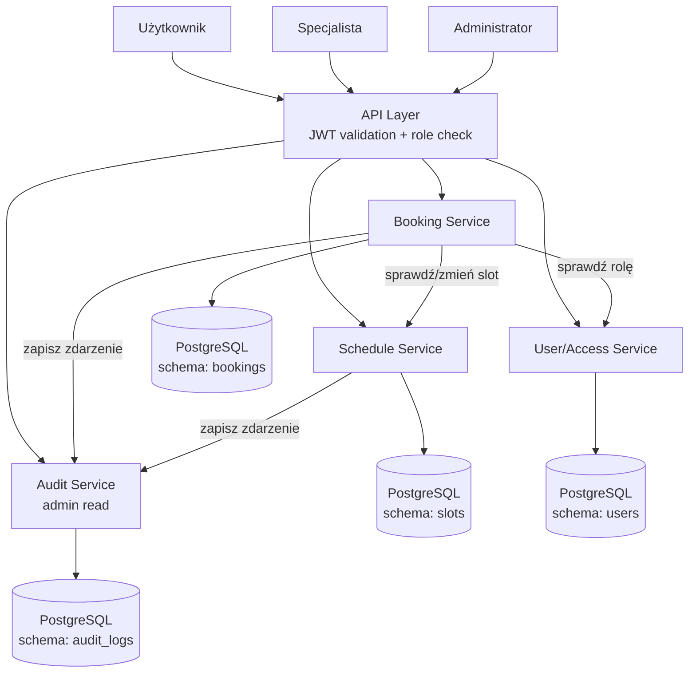

# Analiza domenowa systemu rezerwacji wizyt

# 1. Główne Bounded Contexts

## 1. Rezerwacje (Booking Context)

### Odpowiedzialność

Zarządzanie procesem rezerwacji wizyt oraz kontrola ich cyklu życia.

### Główne funkcjonalności

* tworzenie rezerwacji,
* anulowanie rezerwacji,
* walidacja limitu aktywnych rezerwacji,
* wykrywanie konfliktów czasowych z innymi wizytami użytkownika,
* zmiana statusów rezerwacji,
* obsługa współbieżnych prób rezerwacji.

### Główne encje

* Rezerwacja (Booking)
* StatusRezerwacji (BookingStatus)
* HistoriaRezerwacji (BookingHistory)

### Reguły biznesowe

* jeden slot może posiadać tylko jedną aktywną rezerwację,
* użytkownik może posiadać maksymalnie 3 aktywne rezerwacje,
* anulowanie jest możliwe tylko do 24 godzin przed wizytą,
* system musi zapewnić spójność przy równoczesnych próbach rezerwacji,
* przy anulowaniu slot wraca do AVAILABLE, chyba że był wcześniej BLOCKED.

---

## 2. Zarządzanie Grafikiem (Schedule Context)

### Odpowiedzialność

Zarządzanie dostępnością specjalistów oraz terminami wizyt. Schedule Service udostępnia sloty i zmienia ich statusy na żądanie Booking Service.

### Główne funkcjonalności

* dodawanie slotów przez specjalistę,
* usuwanie wolnych slotów,
* blokowanie slotów (niezależnie od rezerwacji),
* udostępnianie dostępnych terminów użytkownikom,
* zmiana statusu slotu (AVAILABLE → BOOKED → AVAILABLE/BLOCKED).

### Główne encje

* Slot (AppointmentSlot)

### Reguły biznesowe

* slot może posiadać status:

  * AVAILABLE
  * BOOKED
  * BLOCKED
  * COMPLETED

* zablokowany slot nie może zostać zarezerwowany,
* tylko specjalista lub admin może blokować/odblokowywać slot.

---

## 3. Zarządzanie Użytkownikami i Rolami (User/Access Context)

### Odpowiedzialność

Zarządzanie kontami oraz uprawnieniami użytkowników systemu. Specjalista jest użytkownikiem z rolą SPECIALIST i dodatkowym atrybutem specjalizacji.

### Główne funkcjonalności

* zarządzanie użytkownikami,
* zarządzanie specjalistami (jako rozszerzenie profilu użytkownika),
* przypisywanie ról.

### Główne encje

* Użytkownik (User) — z atrybutem `role` (USER, SPECIALIST, ADMIN)
* Specjalista (Specialist) — powiązany z User przez user_id

### Reguły biznesowe

* każdy użytkownik posiada dokładnie jedną rolę,
* uprawnienia wynikają z przypisanej roli,
* Specialist to rozszerzenie User, a nie oddzielna encja tożsamości.

---

## 4. Audyt (Audit Context)

### Odpowiedzialność

Centralne rejestrowanie operacji biznesowych. Audit Service jest wywoływany przez Booking Service i Schedule Service po każdej zmianie stanu.

### Główne funkcjonalności

* zapis historii rezerwacji i anulowań,
* zapis modyfikacji grafiku i blokad,
* prowadzenie niemodyfikowalnego logu audytowego,
* udostępnianie historii operacji dla admina.

### Główne encje

* LogAudytowy (AuditLog)

### Reguły biznesowe

* logi są niemodyfikowalne (append-only),
* każda operacja posiada znacznik czasu, typ zdarzenia, id użytkownika i id slotu,
* odrzucone operacje (np. próba podwójnej rezerwacji) również są logowane.

---

# 2. Najważniejsze encje domenowe

| Encja            | Opis                                        |
| ---------------- | ------------------------------------------- |
| User             | Konto użytkownika systemu z rolą            |
| Specialist       | Rozszerzenie profilu użytkownika-specjalisty|
| AppointmentSlot  | Slot czasowy w grafiku specjalisty          |
| Booking          | Rezerwacja slotu przez użytkownika          |
| BookingStatus    | Status rezerwacji (BOOKED, CANCELLED)       |
| AuditLog         | Niemodyfikowalny log operacji               |

---

# 3. Relacje pomiędzy encjami

```
User (role: USER)
 └── 1..* Booking
             │
             ▼
      AppointmentSlot
             │
             ▼
        Specialist (User z rolą SPECIALIST)

Booking
 ├── BookingStatus (BOOKED | CANCELLED)
 └── odniesienie do AuditLog

AuditLog
 └── zapisuje wszystkie operacje na:
      - Booking (BOOKING_CREATED, BOOKING_CANCELLED, BOOKING_REJECTED)
      - AppointmentSlot (SLOT_BLOCKED, SLOT_RELEASED)
```

---

# 4. Agregaty domenowe

## Aggregate: Booking

Root:

* Booking

Obiekty podrzędne:

* BookingStatus

Odpowiedzialność:

* utworzenie rezerwacji,
* anulowanie,
* zmiana statusu,
* kontrola limitu aktywnych rezerwacji,
* wykrywanie konfliktów czasowych.

---

## Aggregate: AppointmentSlot

Root:

* AppointmentSlot

Odpowiedzialność:

* zarządzanie dostępnością slotu,
* blokowanie i odblokowywanie slotu,
* zmiana statusu (AVAILABLE, BOOKED, BLOCKED, COMPLETED).

---

# 5. Kluczowe zdarzenia domenowe

* BookingCreated
* BookingCancelled
* BookingRejected (limit lub konflikt)
* SlotBlocked
* SlotReleased
* SlotStatusChanged

---

# 6. Podsumowanie

Uproszczony i spójny podział systemu obejmuje cztery główne Bounded Contexts:

1. Booking Context – zarządzanie rezerwacjami, limit, konflikty czasowe.
2. Schedule Context – zarządzanie slotami specjalisty, statusy, blokady.
3. User/Access Context – użytkownicy i role (Specialist jako rozszerzenie User).
4. Audit Context – niemodyfikowalny log operacji biznesowych.

Taki podział eliminuje zbędną domenę Configuration jako osobny kontekst — reguły anulowania i limit rezerwacji to logika Booking Service. Specjalista nie jest osobną encją tożsamości, lecz profilem powiązanym z User.


# Propozycja architektury systemu rezerwacji wizyt

# 1. Wybór wzorców architektonicznych

## Główny wzorzec: Modular Monolith

### Uzasadnienie

Dla analizowanego systemu najlepszym wyborem jest **Modular Monolith** z wyraźnie wydzielonymi modułami domenowymi i wspólną relacyjną bazą danych (PostgreSQL).

**Powody wyboru:**

### Zalety

* logiczny podział na Bounded Contexts realizowany jako moduły wewnątrz jednej aplikacji,
* wspólna baza danych umożliwia transakcyjną obsługę rezerwacji bez distributed transactions,
* brak kosztów komunikacji sieciowej pomiędzy modułami,
* prostsze wdrażanie i testowanie,
* możliwość późniejszej migracji wybranych modułów do mikroserwisów.

### Dlaczego nie Microservices?

System posiada wymagania dotyczące:

* silnej spójności rezerwacji (transakcja obejmuje zapis Booking i zmianę statusu Slot),
* kontroli limitu aktywnych rezerwacji (wymaga wglądu w dane booking i slot w jednej transakcji),
* obsługi współbieżności i double booking.

Implementacja tych mechanizmów w architekturze mikroserwisowej wymagałaby Sagi, Eventual Consistency lub Distributed Transactions — co znacząco zwiększyłoby złożoność bez wyraźnych korzyści przy tej skali systemu.

### Baza danych

Wspólna baza PostgreSQL z logicznym podziałem na schematy per moduł. Dzięki temu operacja rezerwacji (zapis do `bookings` + zmiana statusu w `slots`) może być wykonana atomowo w jednej transakcji bazodanowej.

---

# Dodatkowe wzorce architektoniczne

## 1. Repository Pattern

Każdy moduł posiada własne repozytoria ukrywające dostęp do danych:

* BookingRepository
* SlotRepository
* UserRepository
* AuditRepository

Dzięki temu domena nie zależy od technologii bazy danych i każdy moduł kapsułkuje swoje schematy.

---

## 2. CQRS (selektywnie w Booking Module)

### Commands

Operacje modyfikujące dane:

* CreateBooking
* CancelBooking
* BlockSlot
* AddSlot

### Queries

Operacje odczytu (mogą korzystać z Read Replica lub cache):

* GetAvailableSlots
* GetMyBookings
* GetAuditLog

### Uzasadnienie

CQRS stosowany selektywnie w Booking Module pozwala zoptymalizować zapytania odczytowe (lista moich rezerwacji, dostępne terminy) bez komplikowania modelu zapisu. Nie wdrażamy osobnych baz dla read/write — wystarczy oddzielenie klas serwisów.

---

## 3. Optimistic Locking

Stosowane w tabeli `slots` (pole `version`). Przy próbie rezerwacji:

```sql
UPDATE slots SET status = 'BOOKED', version = version + 1
WHERE id = :slotId AND version = :currentVersion AND status = 'AVAILABLE'
```

Jeśli operacja zmodyfikuje 0 wierszy — inny użytkownik zarezerwował slot wcześniej. System zwraca 409 Conflict.

---

## 4. Domain Events (in-process)

Najważniejsze zdarzenia publikowane wewnątrz aplikacji po zakończeniu transakcji:

```
BookingCreated    → Audit Service zapisuje log
BookingCancelled  → Audit Service zapisuje log
BookingRejected   → Audit Service zapisuje log
SlotBlocked       → Audit Service zapisuje log
```

Zdarzenia są in-process (nie wymagają zewnętrznego brokera wiadomości). Audit Service konsumuje je i zapisuje do tabeli `audit_logs`.

---

# 2. Komponenty systemu

## 1. API Layer

### Odpowiedzialność

* obsługa żądań HTTP,
* walidacja danych wejściowych,
* sprawdzenie roli użytkownika (token JWT),
* przekazanie żądania do odpowiedniego serwisu.

---

## 2. Booking Service

### Odpowiedzialność

* tworzenie rezerwacji (z pełną walidacją),
* anulowanie rezerwacji (z weryfikacją właściciela i warunku 24h),
* kontrola limitu 3 aktywnych rezerwacji na użytkownika,
* wykrywanie konfliktów czasowych (czy nowa wizyta nie nakłada się na istniejące rezerwacje użytkownika),
* koordynacja z Schedule Service (sprawdzenie slotu, zmiana statusu),
* koordynacja z Audit Service (zapis zdarzenia po każdej operacji).

### Udostępniane operacje

```
createBooking(userId, slotId)
cancelBooking(bookingId, userId)
getMyBookings(userId)
```

---

## 3. Schedule Service

### Odpowiedzialność

* dodawanie slotów przez specjalistę,
* usuwanie wolnych slotów,
* blokowanie i odblokowywanie slotów (status BLOCKED),
* udostępnianie dostępnych terminów (filtrowanie po specialist_id, dacie),
* zmiana statusu slotu na żądanie Booking Service.

### Udostępniane operacje

```
addSlot(specialistId, startTime, endTime)
deleteSlot(slotId)
blockSlot(slotId)
getAvailableSlots(specialistId, date)
getSlotById(slotId)
changeSlotStatus(slotId, newStatus)
```

---

## 4. User/Access Service

### Odpowiedzialność

* identyfikacja roli użytkownika (USER, SPECIALIST, ADMIN),
* kontrola dostępu do operacji,
* zarządzanie profilem specjalisty (specjalizacja).

### Udostępniane operacje

```
getUserRole(userId)
getSpecialistById(specialistId)
```

---

## 5. Audit Service

### Odpowiedzialność

* odbieranie zdarzeń domenowych in-process,
* zapisywanie logów audytowych (append-only),
* udostępnianie historii operacji dla admina.

### Udostępniane operacje

```
logEvent(eventType, userId, slotId, details)
getAuditHistory(filters)
```

---

# 3. Komunikacja pomiędzy komponentami

```
Klient (User / Specialist / Admin)
 │
 ▼
API Layer (JWT validation, role check)
 │
 ├── Booking Service
 │       │
 │       ├──► Schedule Service (sprawdź slot, zmień status)
 │       │       └──► Persistence Layer (slots)
 │       │
 │       ├──► User/Access Service (sprawdź uprawnienia)
 │       │
 │       ├──► Persistence Layer (bookings)
 │       │
 │       └──► Audit Service (zapisz zdarzenie)
 │                   └──► Persistence Layer (audit_logs)
 │
 └── Schedule Service (zarządzanie grafikiem przez specjalistę)
         └──► Audit Service (zapisz zdarzenie)
```

## Komunikacja synchroniczna

Stosowana dla wszystkich operacji biznesowych:

* Booking Service → Schedule Service (sprawdzenie i zmiana statusu slotu w tej samej transakcji),
* API Layer → dowolny serwis.

Realizacja: bezpośrednie wywołania metod między modułami wewnątrz jednej aplikacji (in-process). Brak HTTP między modułami.

---

## Komunikacja z Audit Service

Po zakończeniu transakcji biznesowej, Booking Service lub Schedule Service wywołuje Audit Service in-process:

```
auditService.logEvent("BOOKING_CREATED", userId, slotId, details)
```

Audit Service zapisuje zdarzenie do tabeli `audit_logs`.

---

# 4. Przepływ rezerwacji (kluczowy flow)

Użytkownik wysyła `POST /bookings`:

1. API Layer waliduje format danych i token JWT,
2. Booking Service sprawdza uprawnienia użytkownika (rola USER),
3. Booking Service pobiera slot przez Schedule Service → sprawdza status AVAILABLE,
4. Booking Service sprawdza liczbę aktywnych rezerwacji użytkownika (max 3),
5. Booking Service sprawdza, czy nowa wizyta nie nakłada się czasowo na istniejące rezerwacje użytkownika,
6. Booking Service uruchamia transakcję:
   a. zapisuje Booking (status: BOOKED),
   b. zmienia status Slotu na BOOKED,
7. Booking Service wywołuje Audit Service → zapis zdarzenia `BOOKING_CREATED`,
8. System zwraca 201 Created z danymi rezerwacji.

Jeśli w kroku 3 slot jest BOOKED lub BLOCKED → 409 Conflict,
Jeśli w kroku 4 przekroczono limit → 422 Unprocessable Entity,
Jeśli w kroku 5 wykryto nakładanie → 409 Conflict.

---

# 5. Przepływ anulowania

Użytkownik wysyła `DELETE /bookings/{id}`:

1. API Layer waliduje token JWT,
2. Booking Service sprawdza, czy rezerwacja należy do użytkownika,
3. Booking Service sprawdza, czy do wizyty zostało więcej niż 24h,
4. Booking Service uruchamia transakcję:
   a. zmienia status Bookingu na CANCELLED,
   b. zmienia status Slotu na AVAILABLE (lub BLOCKED, jeśli slot był wcześniej zablokowany),
5. Booking Service wywołuje Audit Service → zapis zdarzenia `BOOKING_CANCELLED`,
6. System zwraca 200 OK.

---

# 6. Mapowanie wymagań na komponenty

| Wymaganie                          | Komponent                                    |
| ---------------------------------- | -------------------------------------------- |
| Przeglądanie dostępnych terminów   | Schedule Service                             |
| Rezerwacja wizyty                  | Booking Service                              |
| Zapobieganie double booking        | Booking Service (Optimistic Locking + UNIQUE)|
| Limit 3 aktywnych rezerwacji       | Booking Service                              |
| Wykrywanie konfliktów czasowych    | Booking Service (sprawdzenie nakładania)     |
| Anulowanie do 24 godzin            | Booking Service                              |
| Blokowanie slotu przez specjalistę | Schedule Service                             |
| Stan BLOCKED slotu                 | Schedule Service                             |
| Zarządzanie rolami                 | User/Access Service                          |
| Log audytowy                       | Audit Service                                |
| Historia operacji (admin)          | Audit Service                                |
| Obsługa współbieżności             | Booking Service + Optimistic Locking         |

---

# 7. Diagram architektury (Mermaid)



> Wszystkie schematy należą do tej samej bazy PostgreSQL, co umożliwia transakcyjne operacje cross-schema.

---

# 8. Podsumowanie decyzji architektonicznych

| Element                     | Wybrany wzorzec                    | Uzasadnienie                                                        |
| --------------------------- | ---------------------------------- | ------------------------------------------------------------------- |
| Architektura systemu        | Modular Monolith                   | Prostota, spójność danych, transakcyjność                           |
| Baza danych                 | Wspólna PostgreSQL (multi-schema)  | Transakcyjna rezerwacja (booking + slot w jednej transakcji)        |
| Odczyt/Zapis                | Selektywne CQRS w Booking          | Optymalizacja zapytań odczytowych bez nadmiernej złożoności         |
| Dostęp do danych            | Repository Pattern                 | Kapsułkowanie schematu danych per moduł                             |
| Spójność danych             | Optimistic Locking + UNIQUE        | Zapobieganie double booking przy współbieżnych żądaniach            |
| Komunikacja między modułami | In-process method calls            | Brak overhead sieciowego, możliwość transakcji cross-module         |
| Audyt                       | Domain Events → Audit Service      | Oddzielenie logiki audytu od logiki biznesowej                      |


# Projekt API oraz struktur baz danych

W celu zapewnienia spójności i prostoty implementacji, wszystkie moduły korzystają z jednej bazy PostgreSQL podzielonej na logiczne schematy. Dzięki temu rezerwacja slotu (zapis do `bookings` + zmiana `slots.status`) jest wykonywana w jednej transakcji ACID.

---

## 1. Specyfikacja API (RESTful)

Wszystkie operacje modyfikujące (Commands) zwracają standardowe kody HTTP. Endpointy wymagają nagłówka `Authorization: Bearer <JWT>`. Uprawnienia zależą od roli użytkownika.

### 1.1 Endpointy dla Użytkownika (rola: USER)

* **`GET /api/v1/slots?specialist_id=&date=`**
    * **Opis:** Przeglądanie dostępnych terminów. Zwraca sloty o statusie AVAILABLE.
    * **Response (200 OK):**
        ```json
        [
          {
            "slot_id": "uuid",
            "specialist_id": "uuid",
            "specialist_name": "dr Jan Kowalski",
            "specialization": "Kardiolog",
            "start_time": "2026-06-15T09:00:00Z",
            "end_time": "2026-06-15T09:30:00Z",
            "status": "AVAILABLE"
          }
        ]
        ```

* **`POST /api/v1/bookings`**
    * **Opis:** Tworzenie rezerwacji. Booking Service waliduje dostępność, limit i konflikty.
    * **Request Body:**
        ```json
        { "slot_id": "uuid" }
        ```
    * **Response (201 Created):**
        ```json
        {
          "booking_id": "uuid",
          "slot_id": "uuid",
          "status": "BOOKED",
          "created_at": "2026-06-11T15:45:00Z"
        }
        ```
    * **Response (409 Conflict):** Slot zajęty lub konflikt czasowy.
    * **Response (422):** Przekroczono limit 3 aktywnych rezerwacji.

* **`DELETE /api/v1/bookings/{id}`**
    * **Opis:** Anulowanie rezerwacji (tylko własnej, min. 24h przed wizytą).
    * **Response (200 OK):** `{ "status": "CANCELLED" }`

* **`GET /api/v1/bookings/my`**
    * **Opis:** Lista aktywnych i historycznych rezerwacji zalogowanego użytkownika.

---

### 1.2 Endpointy dla Specjalisty (rola: SPECIALIST)

* **`POST /api/v1/slots`**
    * **Opis:** Dodanie nowego slotu.
    * **Request Body:**
        ```json
        {
          "start_time": "2026-06-15T09:00:00Z",
          "end_time": "2026-06-15T09:30:00Z"
        }
        ```

* **`DELETE /api/v1/slots/{id}`**
    * **Opis:** Usunięcie wolnego slotu (tylko jeśli status AVAILABLE).

* **`PATCH /api/v1/slots/{id}/block`**
    * **Opis:** Zablokowanie slotu (status → BLOCKED). Slot niedostępny dla rezerwacji.

* **`GET /api/v1/slots/my`**
    * **Opis:** Grafik specjalisty (wszystkie sloty, niezależnie od statusu).

---

### 1.3 Endpointy dla Administratora (rola: ADMIN)

* **`GET /api/v1/admin/users`**
    * **Opis:** Lista wszystkich użytkowników z rolami.

* **`GET /api/v1/admin/bookings`**
    * **Opis:** Wszystkie rezerwacje w systemie.

* **`GET /api/v1/admin/audit-log`**
    * **Opis:** Historia operacji. Obsługuje filtry: `user_id`, `event_type`, `date_from`, `date_to`.
    * **Response (200 OK):**
        ```json
        [
          {
            "id": "uuid",
            "event_type": "BOOKING_CREATED",
            "user_id": "uuid",
            "slot_id": "uuid",
            "timestamp": "2026-06-11T15:45:00Z",
            "details": "Rezerwacja slotu 2026-06-15 09:00"
          }
        ]
        ```

---

## 2. Struktury baz danych

### Schemat: `users`

#### Tabela: `users`
* `id` : `UUID` (PK)
* `name` : `VARCHAR(200)`
* `email` : `VARCHAR(255)` (UNIQUE)
* `password_hash` : `VARCHAR(255)`
* `role` : `VARCHAR(20)` (USER, SPECIALIST, ADMIN)
* `created_at` : `TIMESTAMPTZ`

#### Tabela: `specialists`
* `id` : `UUID` (PK)
* `user_id` : `UUID` (FK → users.id, UNIQUE)
* `specialization` : `VARCHAR(100)`

---

### Schemat: `slots`

#### Tabela: `slots`

Kluczowa tabela dla wydajności i spójności systemu.

* `id` : `UUID` (PK)
* `specialist_id` : `UUID` (FK → users.id)
* `start_time` : `TIMESTAMPTZ`
* `end_time` : `TIMESTAMPTZ`
* `status` : `VARCHAR(20)` (AVAILABLE, BOOKED, BLOCKED, COMPLETED)
* `version` : `INT` — **Optimistic Locking** (zapobieganie double booking)

*Indeksy:*
* `idx_slots_lookup (specialist_id, start_time, status)` — wyszukiwanie wolnych terminów,
* `UNIQUE (id)` — zapewnienie integralności.

---

### Schemat: `bookings`

#### Tabela: `bookings`

* `id` : `UUID` (PK)
* `user_id` : `UUID` (FK → users.id)
* `slot_id` : `UUID` (FK → slots.id, **UNIQUE** — uniemożliwia podwójną rezerwację)
* `status` : `VARCHAR(20)` (BOOKED, CANCELLED)
* `created_at` : `TIMESTAMPTZ`

*Indeksy:*
* `idx_bookings_user_status (user_id, status)` — sprawdzanie limitu aktywnych rezerwacji.

---

### Schemat: `audit_logs`

#### Tabela: `audit_logs`

Append-only. Konto aplikacyjne ma tylko uprawnienia INSERT.

* `id` : `UUID` (PK)
* `event_type` : `VARCHAR(50)` (BOOKING_CREATED, BOOKING_CANCELLED, BOOKING_REJECTED, SLOT_BLOCKED, SLOT_RELEASED)
* `user_id` : `UUID`
* `slot_id` : `UUID`
* `timestamp` : `TIMESTAMPTZ`
* `details` : `TEXT`

*Indeksy:*
* `idx_audit_timestamp (timestamp DESC)`,
* `idx_audit_user (user_id, timestamp DESC)`.

---

## 3. Realizacja wymagań niefunkcjonalnych

1. **Współbieżność i Spójność:** Transakcja rezerwacji używa Optimistic Locking (`version`) oraz `UNIQUE` na `slot_id` w tabeli `bookings`. Jeśli UPDATE zwróci 0 zmodyfikowanych wierszy — inny użytkownik zarezerwował slot wcześniej → HTTP 409.

2. **Limit 3 rezerwacji:** Przed zapisem rezerwacji:
   ```sql
   SELECT COUNT(*) FROM bookings WHERE user_id = :userId AND status = 'BOOKED'
   ```
   Jeśli wynik ≥ 3 → HTTP 422.

3. **Wykrywanie konfliktów czasowych:** Przed zapisem rezerwacji Booking Service pobiera aktywne rezerwacje użytkownika i sprawdza, czy przedziały czasowe się nakładają. Jeśli tak → HTTP 409.

4. **Skalowalność:** Read Replika dla zapytań odczytowych (`GET /slots`, `GET /bookings/my`). Indeksy na kluczowych kolumnach. Paginacja wyników.

5. **Audyt:** Każda operacja (także odrzucona) powoduje zapis do `audit_logs`. Tabela jest append-only.
