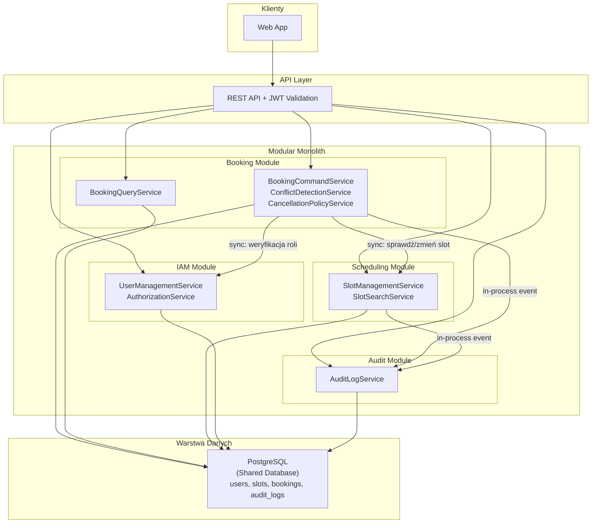

# 1. Analiza Domen i Encji

# Analiza Domenowa (DDD) — System Rezerwacji Wizyt u Specjalistów

## Cel systemu

System umożliwia użytkownikom przeglądanie dostępnych terminów, rezerwowanie i anulowanie wizyt u specjalistów. Specjaliści zarządzają własnym grafikiem, a administratorzy mają wgląd w operacje i zarządzają użytkownikami.

---

# Zidentyfikowane Bounded Contexts

Przyglądając się wymaganiom funkcjonalnym i rolom, wyodrębniam następujące, spójne domeny biznesowe. Zdecydowałem się na **Modular Monolith** zamiast mikroserwisów — dla tej skali systemu daje to lepszą kontrolę transakcyjności przy niższym koszcie operacyjnym.

## 1. Identity & Access Management (IAM)

* **Uzasadnienie:** Wymagania definiują trzy role (`USER`, `SPECIALIST`, `ADMIN`) z różnymi uprawnieniami. Potrzebujemy centralnego miejsca do zarządzania tożsamościami i kontrolą dostępu.
* **Cel:** Zarządzanie kontami użytkowników, rolami i procesami uwierzytelniania.
* **Kluczowe Encje Domenowe:**
    * **User:** Podstawowa jednostka użytkownika z danymi profilowymi i rolą.
    * **Specialist:** Rozszerzenie profilu User-a o dane specjalistyczne (specjalizacja).
    * **Role:** Określa uprawnienia (USER, SPECIALIST, ADMIN).

---

## 2. Scheduling & Availability (Zarządzanie Grafikiem i Slotami)

* **Uzasadnienie:** Specjalista zarządza swoim grafikiem, dodaje i blokuje sloty. Użytkownicy przeglądają dostępne terminy.
* **Cel:** Zarządzanie slotami czasowymi specjalistów, ich statusami i blokowaniem.
* **Kluczowe Encje Domenowe:**
    * **Slot (AppointmentSlot):** Pojedynczy slot czasowy — główna encja tego kontekstu.
        * `id`, `specialistId`, `startTime`, `endTime`, `status`, `version`
        * Status: `AVAILABLE`, `BOOKED`, `BLOCKED`, `COMPLETED`

> **Zmiana względem poprzedniej wersji:** Zrezygnowałem z osobnej encji Schedule jako Aggregate Root. Slot bezpośrednio należy do specjalisty (przez `specialistId`), co upraszcza model.

---

## 3. Appointment Booking (Zarządzanie Rezerwacjami)

* **Uzasadnienie:** To jest centralna domena biznesowa systemu — tu skupia się kluczowa logika.
* **Cel:** Obsługa procesu rezerwacji wizyt, ich anulowania, walidacji reguł biznesowych.
* **Kluczowe Encje Domenowe:**
    * **Booking:** Główna encja reprezentująca zarezerwowaną wizytę.
        * `id`, `userId`, `slotId`, `status` (BOOKED, CANCELLED), `createdAt`
* **Invariants:**
    * Jeden slot może mieć tylko jedną aktywną rezerwację.
    * Użytkownik może mieć maksymalnie 3 aktywne rezerwacje.
    * Anulowanie możliwe tylko do 24h przed wizytą.
    * Nowa wizyta nie może nakładać się czasowo na istniejące rezerwacje użytkownika.
    * Po anulowaniu slot wraca do AVAILABLE lub BLOCKED (zależnie od poprzedniego stanu).

---

## 4. Audit & History (Audyt i Historia Operacji)

* **Uzasadnienie:** Administrator potrzebuje historii operacji. Audyt to wyraźnie oddzielna odpowiedzialność.
* **Cel:** Rejestrowanie operacji (rezerwacje, anulowania, blokady, odrzucone próby). Logi są niemodyfikowalne.
* **Kluczowe Encje Domenowe:**
    * **AuditLog:** Log operacji.
        * `id`, `eventType`, `userId`, `slotId`, `timestamp`, `details`

---

# Najważniejsze Encje Domenowe (w podziale na konteksty)

* **IAM:** `User`, `Specialist`, `Role`
* **Scheduling:** `Slot`
* **Booking:** `Booking`
* **Audit:** `AuditLog`

---

# Relacje Między Kontekstami

```
Identity & Access
        |
        v (synchronicznie)
Booking <------ Scheduling
   |               |
   v               v
     Audit Context
     (in-process events)
```

Booking Context korzysta synchronicznie z Scheduling i Identity. Oba konteksty wysyłają zdarzenia in-process do Audit.

---

# Domain Events

* `BookingCreated` — Booking → Audit
* `BookingCancelled` — Booking → Audit
* `BookingRejected` — Booking → Audit (limit lub konflikt)
* `SlotBlocked` — Scheduling → Audit
* `SlotReleased` — Scheduling → Audit

---

# Podsumowanie

Na podstawie analizy wymagań zidentyfikowano **4 główne Bounded Contexts**:

1. Identity & Access Management (IAM)
2. Scheduling & Availability
3. Appointment Booking
4. Audit & History

Zrezygnowano z osobnych kontekstów Notification (powiadomienia nie są kluczowym wymaganiem), Reporting (zastąpiony przez Audit) i System Configuration (reguły anulowania i limit 3 rezerwacji to wewnętrzna logika Booking, a nie osobna domena). Uproszczono model Scheduling — Slot bezpośrednio należy do specjalisty.

---

# 2. Zaproponowana Architektura

Na podstawie analizy domen proponuję architekturę opartą na **Modular Monolith** ze wspólną relacyjną bazą danych. To jest celowa zmiana względem architektury mikroserwisów — przy tej skali systemu Modular Monolith jest lepszym kompromisem.

---

## 1. Wybór Wzorców Architektonicznych i Uzasadnienie

**Główny Wzorzec: Modular Monolith**

**Uzasadnienie:**

1. **Transakcyjność rezerwacji:** Operacja rezerwacji wymaga atomowego INSERT do `bookings` i UPDATE `slots.status` — w mikroserwisach wymagałoby to Sagi lub distributed transactions. W monolicie z jedną bazą PostgreSQL to prosta transakcja ACID.

2. **Mniejszy overhead operacyjny:** Brak potrzeby API Gateway, Message Broker (Kafka/RabbitMQ), service discovery, distributed tracing. Jedna aplikacja, jeden deployment.

3. **Jasne granice domenowe:** 4 zidentyfikowane BC mapują się 1:1 na moduły wewnętrzne. Komunikacja przez publiczne interfejsy (in-process).

4. **Skalowalność:** Wystarczy Read Replica dla zapytań odczytowych i horizontal scaling aplikacji (bezstanowe API z JWT).

**Wzorce Komplementarne:**

* **CQRS (selektywnie w Booking Module):** Rozdzielenie klas do zapisu (BookingCommandService) od odczytu (BookingQueryService) bez rozdzielania baz danych.
* **Optimistic Locking:** Pole `version` w tabeli `slots` zapobiega double booking przy równoczesnych żądaniach.
* **Domain Events (in-process):** Komunikacja między Booking/Scheduling a Audit — bez zewnętrznego brokera.

---

## 2. Proponowane Moduły, Odpowiedzialności i Komunikacja

**A. Moduły aplikacyjne (z Bounded Contexts):**

1. **IAM Module (Identity & Access Management)**
    * **Odpowiedzialności:** Zarządzanie użytkownikami, rolami (USER/SPECIALIST/ADMIN), uwierzytelnianie (JWT), autoryzacja.
    * **Komunikacja:** Synchronicznie odpowiada na zapytania z Booking i Scheduling (weryfikacja roli).

2. **Scheduling Module (Scheduling & Availability)**
    * **Odpowiedzialności:** Zarządzanie slotami specjalistów (CRUD), blokowanie slotów (status BLOCKED), udostępnianie dostępnych terminów, zmiana statusu slotu na żądanie Booking.
    * **Komunikacja:**
        * **Synchroniczna:** Odpowiada na zapytania z Booking Module (sprawdzenie slotu, zmiana statusu).
        * **In-process Event:** Publikuje `SlotBlocked`, `SlotReleased` do Audit Module.

3. **Booking Module (Appointment Booking)**
    * **Odpowiedzialności:** Tworzenie rezerwacji z pełną walidacją (dostępność, limit 3, konflikty czasowe), anulowanie rezerwacji (warunek 24h, weryfikacja właściciela), historia rezerwacji.
    * **Komunikacja:**
        * **Synchroniczna:** Wywołuje Scheduling Module (sprawdzenie slotu, zmiana statusu w tej samej transakcji), wywołuje IAM Module (weryfikacja roli).
        * **In-process Event:** Publikuje `BookingCreated`, `BookingCancelled`, `BookingRejected` do Audit Module.

4. **Audit Module (Audit & History)**
    * **Odpowiedzialności:** Odbieranie zdarzeń in-process, zapis logów (append-only), udostępnianie historii operacji dla admina.
    * **Komunikacja:** Tylko In-process events od Booking i Scheduling. Brak zależności wychodzących.

**B. Komponenty Wspierające:**

* **API Layer:** Jednolity punkt wejścia, JWT validation, role check, routing do modułów.
* **PostgreSQL (Shared DB):** Wspólna baza danych dla wszystkich modułów — umożliwia transakcyjne operacje cross-module.

---

## 3. Mapowanie Wymagań na Komponenty

| Wymaganie | Komponent(y) Realizujące |
|-----------|--------------------------|
| Przeglądanie dostępnych terminów (FR1) | Scheduling Module |
| Dokonywanie rezerwacji (FR2) | Booking Module + Scheduling Module |
| Zapobieganie double booking | Booking Module (Optimistic Locking + UNIQUE) |
| Limit 3 aktywnych rezerwacji | Booking Module |
| Wykrywanie konfliktów czasowych | Booking Module |
| Anulowanie w oknie 24h (FR3) | Booking Module |
| Zarządzanie grafikiem (FR4) | Scheduling Module |
| Blokowanie slotów (BLOCKED) | Scheduling Module |
| Role i uprawnienia (FR6) | IAM Module + API Layer |
| Historia operacji | Booking Module + Audit Module |
| Logi audytowe | Audit Module |
| Skalowalność | Modular Monolith + CQRS + Read Replica |

---

## 4. Przepływ Rezerwacji

Użytkownik wysyła `POST /api/v1/bookings`:

1. API Layer waliduje JWT i sprawdza rolę USER.
2. Booking Module pobiera slot przez Scheduling Module → sprawdza status AVAILABLE.
3. Booking Module sprawdza liczbę aktywnych rezerwacji użytkownika (max 3).
4. Booking Module sprawdza, czy nowa wizyta nie nakłada się czasowo na istniejące.
5. Booking Module uruchamia transakcję ACID:
   a. INSERT do `bookings` (status: BOOKED),
   b. UPDATE `slots.status = BOOKED` z Optimistic Locking (`version`).
6. Booking Module wysyła in-process event → Audit Module zapisuje log.
7. System zwraca 201 Created.

---

## 5. Diagram Architektury (Mermaid)



---

## 6. Uzasadnienie końcowe

Rekomendowana architektura to **Modular Monolith ze wspólną bazą PostgreSQL**. Kluczowe zalety:

- Transakcyjna rezerwacja (INSERT booking + UPDATE slot w jednej transakcji ACID).
- Brak distributed transactions — kontrola spójności na poziomie SQL.
- Prostszy deployment i operacje.
- Jasne granice domenowe (4 moduły) — gotowość na przyszłą ekstrakcję do mikroserwisów.
- Niższy koszt operacyjny przy tej skali systemu.

---

# 3. API i Modele Danych

## 1. Kluczowe Endpointy API (RESTful)

Wszystkie endpointy wymagają nagłówka `Authorization: Bearer <JWT>`. Wersjonowanie: `/api/v1`.

---

### 1.1 Endpointy dla Użytkownika (rola: USER)

**GET /api/v1/slots?specialist_id=&date=**

Przeglądanie dostępnych terminów specjalisty. Zwraca sloty w statusie AVAILABLE.

Response (200 OK):

```json
[
  {
    "slotId": "uuid",
    "specialistId": "uuid",
    "specialistName": "dr Jan Kowalski",
    "specialization": "Kardiolog",
    "startTime": "2026-06-15T09:00:00Z",
    "endTime": "2026-06-15T09:30:00Z",
    "status": "AVAILABLE"
  }
]
```

---

**POST /api/v1/bookings**

Tworzenie rezerwacji.

Request Body:

```json
{
    "slotId": "uuid"
}
```

Response (201 Created):

```json
{
    "id": "uuid",
    "userId": "uuid",
    "slotId": "uuid",
    "status": "BOOKED",
    "createdAt": "2026-06-11T15:45:00Z"
}
```

Response (409 Conflict) — slot zajęty lub nakładanie wizyt:

```json
{
    "code": "SLOT_CONFLICT",
    "message": "Wybrany termin jest już zajęty lub nakłada się z istniejącą wizytą."
}
```

Response (422) — limit rezerwacji:

```json
{
    "code": "BOOKING_LIMIT_EXCEEDED",
    "message": "Przekroczono limit 3 aktywnych rezerwacji."
}
```

---

**DELETE /api/v1/bookings/{bookingId}**

Anulowanie własnej rezerwacji (min. 24h przed wizytą).

Response (200 OK):

```json
{
    "bookingId": "uuid",
    "status": "CANCELLED",
    "slotStatus": "AVAILABLE"
}
```

---

**GET /api/v1/bookings/my**

Lista rezerwacji zalogowanego użytkownika.

Response (200 OK):

```json
[
  {
    "bookingId": "uuid",
    "slotId": "uuid",
    "specialistName": "dr Jan Kowalski",
    "startTime": "2026-06-15T09:00:00Z",
    "status": "BOOKED",
    "createdAt": "2026-06-11T15:45:00Z"
  }
]
```

---

### 1.2 Endpointy dla Specjalisty (rola: SPECIALIST)

**POST /api/v1/slots** — Dodanie nowego slotu.

```json
// Request Body
{
    "startTime": "2026-06-20T10:00:00Z",
    "endTime": "2026-06-20T10:30:00Z"
}
```

---

**DELETE /api/v1/slots/{slotId}** — Usunięcie slotu (tylko jeśli AVAILABLE).

---

**PATCH /api/v1/slots/{slotId}/block** — Zablokowanie slotu (status → BLOCKED). Slot niedostępny dla rezerwacji.

Response (200 OK):

```json
{
    "slotId": "uuid",
    "status": "BLOCKED"
}
```

---

**GET /api/v1/slots/my** — Grafik specjalisty (wszystkie sloty, niezależnie od statusu).

---

### 1.3 Endpointy dla Administratora (rola: ADMIN)

**GET /api/v1/admin/users** — Lista wszystkich użytkowników z rolami.

**GET /api/v1/admin/bookings** — Wszystkie rezerwacje w systemie.

**GET /api/v1/admin/audit-log** — Historia operacji systemowych.

Query params: `userId`, `eventType`, `dateFrom`, `dateTo`

Response (200 OK):

```json
[
  {
    "id": "uuid",
    "eventType": "BOOKING_CREATED",
    "userId": "uuid",
    "slotId": "uuid",
    "timestamp": "2026-06-11T15:45:00Z",
    "details": "Rezerwacja slotu 2026-06-15 09:00"
  }
]
```

---

## 2. Struktury Baz Danych

Wspólna baza **PostgreSQL** dla wszystkich modułów. Transakcja rezerwacji (INSERT do `bookings` + UPDATE `slots.status`) jest wykonywana atomowo w jednej transakcji ACID.

---

### Schemat: Tabela `users`

```sql
CREATE TABLE users (
    id UUID PRIMARY KEY DEFAULT gen_random_uuid(),
    email VARCHAR(255) UNIQUE NOT NULL,
    name VARCHAR(200) NOT NULL,
    password_hash VARCHAR(255) NOT NULL,
    role VARCHAR(20) NOT NULL, -- USER | SPECIALIST | ADMIN
    created_at TIMESTAMPTZ DEFAULT now()
);

CREATE TABLE specialists (
    id UUID PRIMARY KEY DEFAULT gen_random_uuid(),
    user_id UUID UNIQUE NOT NULL REFERENCES users(id),
    specialization VARCHAR(100) NOT NULL
);

-- Indeksy:
CREATE INDEX idx_users_email ON users (email);
```

---

### Schemat: Tabela `slots`

```sql
CREATE TABLE slots (
    id UUID PRIMARY KEY DEFAULT gen_random_uuid(),
    specialist_id UUID NOT NULL REFERENCES users(id),
    start_time TIMESTAMPTZ NOT NULL,
    end_time TIMESTAMPTZ NOT NULL,
    status VARCHAR(15) NOT NULL DEFAULT 'AVAILABLE',
        -- AVAILABLE | BOOKED | BLOCKED | COMPLETED
    version INTEGER NOT NULL DEFAULT 1, -- Optimistic Locking
    created_at TIMESTAMPTZ DEFAULT now(),

    CONSTRAINT chk_time_range CHECK (end_time > start_time)
);

-- Indeksy dla wydajności wyszukiwania dostępnych terminów:
CREATE INDEX idx_slots_search
    ON slots (specialist_id, start_time, status)
    WHERE status = 'AVAILABLE';

CREATE INDEX idx_slots_specialist_time ON slots (specialist_id, start_time DESC);
```

**NFR dla wydajności (double booking):** Pole `version` umożliwia Optimistic Locking. Przy rezerwacji:

```sql
UPDATE slots SET status = 'BOOKED', version = version + 1
WHERE id = :slotId AND version = :currentVersion AND status = 'AVAILABLE';
```

Jeśli UPDATE zwróci 0 wierszy → rollback → HTTP 409.

---

### Schemat: Tabela `bookings`

```sql
CREATE TABLE bookings (
    id UUID PRIMARY KEY DEFAULT gen_random_uuid(),
    user_id UUID NOT NULL REFERENCES users(id),
    slot_id UUID NOT NULL UNIQUE REFERENCES slots(id),
        -- UNIQUE: zapobiega podwójnej rezerwacji na poziomie DB
    status VARCHAR(15) NOT NULL DEFAULT 'BOOKED',
        -- BOOKED | CANCELLED
    created_at TIMESTAMPTZ NOT NULL DEFAULT now()
);

-- Indeksy:
CREATE INDEX idx_bookings_user_status ON bookings (user_id, status);
CREATE INDEX idx_bookings_status ON bookings (status);
```

**NFR dla wydajności (limit 3 rezerwacji):**

```sql
SELECT COUNT(*) FROM bookings WHERE user_id = :userId AND status = 'BOOKED';
```

Jeśli wynik ≥ 3 → HTTP 422.

**NFR dla wydajności (wykrywanie konfliktów czasowych):**

```sql
SELECT b.id FROM bookings b
JOIN slots s ON b.slot_id = s.id
WHERE b.user_id = :userId AND b.status = 'BOOKED'
  AND (s.start_time < :newEndTime AND s.end_time > :newStartTime);
```

Jeśli zapytanie zwróci wiersze → HTTP 409 (konflikt czasowy).

---

### Schemat: Tabela `audit_log`

```sql
-- Tabela append-only. Konto aplikacyjne ma tylko uprawnienia INSERT.
CREATE TABLE audit_log (
    id UUID PRIMARY KEY DEFAULT gen_random_uuid(),
    event_type VARCHAR(40) NOT NULL,
        -- BOOKING_CREATED | BOOKING_CANCELLED | BOOKING_REJECTED | SLOT_BLOCKED | SLOT_RELEASED
    user_id UUID NOT NULL,
    slot_id UUID,
    timestamp TIMESTAMPTZ NOT NULL DEFAULT now(),
    details TEXT
);

-- Indeksy:
CREATE INDEX idx_audit_timestamp ON audit_log (timestamp DESC);
CREATE INDEX idx_audit_user ON audit_log (user_id, timestamp DESC);
```

---

## 3. Podsumowanie NFR

* **Spójność przy double booking:** Optimistic Locking (`version`) + UNIQUE constraint na `bookings.slot_id` + transakcja ACID.
* **Limit 3 rezerwacji:** COUNT aktywnych bookingów przed INSERT → HTTP 422.
* **Konflikty czasowe:** SQL overlap check przed INSERT → HTTP 409.
* **Wydajność odczytu:** Partial index na `slots` (`WHERE status = 'AVAILABLE'`) + Read Replica dla GET endpoints.
* **Audyt:** Tabela append-only; logi dla wszystkich operacji (udanych i odrzuconych).
* **Skalowalność:** Stateless API (JWT) → horizontal scaling; Read Replica → odczyt na replikach; paginacja wyników.
