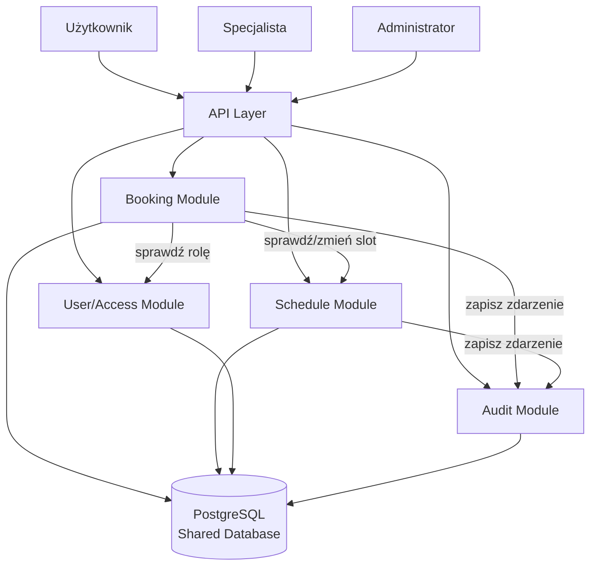

# Analiza domen biznesowych (Bounded Contexts) oraz encji domenowych

# System rezerwacji wizyt u specjalistów

## 1. Wprowadzenie

Na podstawie analizy wymagań biznesowych zidentyfikowano główne obszary odpowiedzialności systemu (Bounded Contexts) zgodnie z podejściem Domain-Driven Design (DDD). Każdy kontekst posiada własną logikę biznesową i komunikuje się z pozostałymi poprzez jasno określone interfejsy. Wspólna relacyjna baza danych zapewnia spójność transakcyjną operacji.

---

# 2. Główne Bounded Contexts

## 2.1. Booking Management (Zarządzanie Rezerwacjami)

### Odpowiedzialność

Obsługa procesu tworzenia, anulowania oraz zarządzania rezerwacjami użytkowników. To jest główna domena systemu — tu skupia się kluczowa logika biznesowa.

### Główne reguły biznesowe

* użytkownik może zarezerwować tylko dostępny (AVAILABLE) termin,
* jeden slot może posiadać tylko jedną aktywną rezerwację,
* użytkownik może posiadać maksymalnie 3 aktywne rezerwacje,
* anulowanie jest możliwe wyłącznie do 24 godzin przed wizytą,
* po anulowaniu slot wraca do AVAILABLE lub pozostaje BLOCKED, zależnie od poprzedniego stanu,
* system musi sprawdzić, czy nowa wizyta nie nakłada się czasowo na istniejące rezerwacje użytkownika.

### Najważniejsze encje

#### Booking

Atrybuty:

* id
* userId
* slotId
* status (BOOKED, CANCELLED)
* createdAt

---

## 2.2. Schedule Management (Zarządzanie Grafikiem)

### Odpowiedzialność

Zarządzanie harmonogramem specjalistów oraz dostępnością slotów. Schedule Service jest odpowiedzialny za zmianę statusów slotów na żądanie Booking Service.

### Główne reguły biznesowe

* specjalista dodaje nowe sloty,
* specjalista usuwa wolne sloty,
* specjalista blokuje sloty (status BLOCKED) niezależnie od rezerwacji,
* tylko specjalista lub admin może blokować i odblokowywać slot.

### Najważniejsze encje

#### Slot (AppointmentSlot)

Atrybuty:

* id
* specialistId
* startTime
* endTime
* status (AVAILABLE, BOOKED, BLOCKED, COMPLETED)
* version (Optimistic Locking)

---

## 2.3. User & Access Management (Zarządzanie Użytkownikami i Uprawnieniami)

### Odpowiedzialność

Obsługa użytkowników i ich ról. Specjalista jest użytkownikiem z rolą SPECIALIST i dodatkowym profilem specjalisty — nie jest oddzielną encją tożsamości.

### Główne reguły biznesowe

* operacje rezerwacji wymagają zalogowania,
* operacje anulowania wymagają zalogowania,
* administrator zarządza użytkownikami.

### Najważniejsze encje

#### User

Atrybuty:

* id
* name
* email
* role (USER, SPECIALIST, ADMIN)

#### Specialist

Atrybuty:

* id
* userId (FK → User)
* specialization

---

## 2.4. Audit & History (Audyt i Historia Operacji)

### Odpowiedzialność

Rejestrowanie wszystkich operacji wykonywanych w systemie — zarówno udanych, jak i odrzuconych. Audit Service jest wywoływany przez Booking Service i Schedule Service po każdej operacji.

### Główne reguły biznesowe

* każda rezerwacja i anulowanie są logowane,
* odrzucone operacje (przekroczony limit, konflikt) również są logowane,
* log zawiera znacznik czasu, typ zdarzenia, id użytkownika i id slotu,
* log jest niemodyfikowalny (append-only).

### Najważniejsze encje

#### AuditLog

Atrybuty:

* id
* eventType
* userId
* slotId
* timestamp
* details

---

# 3. Relacje pomiędzy kontekstami

```
User & Access Management
            │
            ▼
Booking Management ──────────► Schedule Management
            │                           │
            └──────────────────────────►│
                                        │
                      Audit & History ◄─┘
                      (odbiera zdarzenia od obu)
```

---

# 4. Kluczowe encje domenowe

| Encja         | Opis                                          |
| ------------- | --------------------------------------------- |
| User          | Dane użytkownika systemu                      |
| Specialist    | Specjalista z profilem i specjalizacją        |
| Slot          | Dostępny termin wizyty (ze statusem)          |
| Booking       | Rezerwacja wizyty (BOOKED lub CANCELLED)      |
| AuditLog      | Historia operacji systemowych                 |

---

# 5. Podsumowanie

Na podstawie analizy wymagań biznesowych wyodrębniono cztery główne Bounded Contexts:

1. Booking Management
2. Schedule Management
3. User & Access Management
4. Audit & History

Zrezygnowano z osobnego kontekstu Configuration & Rules — reguły anulowania i limit 3 rezerwacji są logiką wewnętrzną Booking Service, a nie osobną domeną. Appointment Management (z poprzedniej wersji) został włączony do Schedule Management, bo slot jest zarządzany przez specjalistę, a nie jako osobna domena cyklu życia. Taki uproszczony podział zapewnia wysoką spójność domenową, łatwość implementacji i testowania.


# Propozycja architektury systemu rezerwacji wizyt

# 1. Wprowadzenie

Na podstawie analizy wymagań biznesowych oraz wyodrębnionych Bounded Contexts zaproponowano architekturę Modular Monolith, której głównym celem jest zapewnienie:

* silnej spójności danych (transakcyjna rezerwacja slotu),
* prostoty implementacji i wdrożenia,
* odporności na współbieżne rezerwacje,
* możliwości rozbudowy w przyszłości.

---

# 2. Wybór wzorców architektonicznych

## 2.1 Modular Monolith

### Uzasadnienie

Głównym wzorcem architektonicznym jest **Modular Monolith** z jedną wspólną relacyjną bazą danych (PostgreSQL).

Powody wyboru:

* system posiada jasno wydzielone domeny biznesowe realizowane jako moduły,
* wspólna baza danych umożliwia transakcyjną operację rezerwacji (zapis Booking + zmiana statusu Slot w jednej transakcji ACID),
* wymagane jest zachowanie silnej spójności danych przy rezerwacjach i anulowaniach,
* prostsze wdrażanie i utrzymanie niż architektura mikroserwisowa,
* brak potrzeby distributed transactions.

Każda domena stanowi niezależny moduł posiadający własną logikę biznesową i interfejs, ale korzystający ze wspólnej bazy danych.

---

## 2.2 CQRS (selektywnie)

### Uzasadnienie

CQRS stosowany selektywnie w Booking Module — oddzielenie klas do odczytu od klas do zapisu:

### Commands

Operacje modyfikujące dane:

* CreateBooking,
* CancelBooking,
* AddSlot,
* BlockSlot.

### Queries

Operacje odczytu (mogą korzystać z Read Replica):

* GetAvailableSlots,
* GetMyBookings,
* GetAuditLog.

CQRS poprawia czytelność kodu i umożliwia niezależną optymalizację odczytu bez rozdzielania baz danych.

---

## 2.3 Optimistic Locking

Stosowane w tabeli `slots` (pole `version`). Przy próbie rezerwacji system wykonuje:

```sql
UPDATE slots SET status = 'BOOKED', version = version + 1
WHERE id = :slotId AND version = :currentVersion AND status = 'AVAILABLE'
```

Jeśli UPDATE zwróci 0 wierszy — inny użytkownik zarezerwował slot wcześniej → HTTP 409 Conflict.

---

# 3. Proponowane komponenty systemu

## 3.1 API Layer

### Odpowiedzialność

* obsługa żądań HTTP,
* walidacja JWT,
* sprawdzenie roli użytkownika,
* przekazanie żądania do odpowiedniego serwisu.

---

## 3.2 Booking Module

### Odpowiedzialność

* tworzenie rezerwacji z pełną walidacją biznesową,
* anulowanie rezerwacji (weryfikacja właściciela i warunku 24h),
* kontrola limitu 3 aktywnych rezerwacji na użytkownika,
* wykrywanie konfliktów czasowych (nakładanie się wizyt),
* koordynacja z Schedule Module (pobranie i zmiana statusu slotu),
* koordynacja z Audit Module (zapis zdarzenia po każdej operacji).

---

## 3.3 Schedule Module

### Odpowiedzialność

* zarządzanie slotami specjalistów,
* dodawanie i usuwanie slotów,
* blokowanie slotów (status BLOCKED),
* udostępnianie dostępnych terminów,
* zmiana statusu slotu na żądanie Booking Module.

---

## 3.4 User/Access Module

### Odpowiedzialność

* identyfikacja roli użytkownika,
* kontrola dostępu do operacji,
* zarządzanie profilem specjalisty.

---

## 3.5 Audit Module

### Odpowiedzialność

* odbieranie zdarzeń po operacjach Booking i Schedule,
* zapis logów audytowych (append-only),
* udostępnianie historii operacji dla admina.

---

# 4. Komunikacja między komponentami

Komunikacja odbywa się wewnątrz Modular Monolith poprzez wywołania metod publicznych interfejsów modułów (in-process). Brak komunikacji sieciowej między modułami.

```
API Layer
    │
    ├── Booking Module
    │       │
    │       ├──► Schedule Module (sprawdź slot, zmień status)
    │       ├──► User/Access Module (sprawdź rolę i uprawnienia)
    │       └──► Audit Module (zapisz zdarzenie)
    │
    └── Schedule Module (zarządzanie grafikiem przez specjalistę)
            └──► Audit Module (zapisz zdarzenie)
```

Każda operacja biznesowa w Booking Module kończy się zapisem do Audit Module.

---

# 5. Przepływ rezerwacji (kluczowy flow)

Użytkownik wysyła `POST /bookings`:

1. API Layer sprawdza JWT i rolę (USER),
2. Booking Module pobiera slot przez Schedule Module,
3. Booking Module sprawdza status slotu (musi być AVAILABLE),
4. Booking Module sprawdza liczbę aktywnych rezerwacji użytkownika (max 3),
5. Booking Module sprawdza, czy nowa wizyta nie nakłada się czasowo na istniejące rezerwacje użytkownika,
6. Booking Module uruchamia transakcję bazodanową:
   a. INSERT do tabeli `bookings` (status: BOOKED),
   b. UPDATE `slots.status = BOOKED` (z Optimistic Locking),
7. Booking Module wywołuje Audit Module → zapis zdarzenia `BOOKING_CREATED`,
8. System zwraca 201 Created.

---

# 6. Przepływ anulowania

Użytkownik wysyła `DELETE /bookings/{id}`:

1. API Layer sprawdza JWT,
2. Booking Module sprawdza, czy rezerwacja należy do użytkownika,
3. Booking Module sprawdza, czy do wizyty pozostało > 24h,
4. Booking Module uruchamia transakcję:
   a. UPDATE `bookings.status = CANCELLED`,
   b. UPDATE `slots.status = AVAILABLE` (lub BLOCKED, jeśli slot był zablokowany przed rezerwacją),
5. Booking Module wywołuje Audit Module → zapis zdarzenia `BOOKING_CANCELLED`,
6. System zwraca 200 OK.

---

# 7. Mapowanie wymagań na komponenty

| Wymaganie                                       | Komponent                                      |
| ----------------------------------------------- | ---------------------------------------------- |
| Przeglądanie dostępnych terminów                | Schedule Module                                |
| Rezerwacja wizyty                               | Booking Module                                 |
| Anulowanie do 24 godzin                         | Booking Module                                 |
| Powrót terminu do puli dostępnych               | Booking Module + Schedule Module               |
| Zapobieganie podwójnej rezerwacji               | Booking Module (Optimistic Locking + UNIQUE)   |
| Limit 3 aktywnych rezerwacji                    | Booking Module                                 |
| Wykrywanie konfliktów czasowych                 | Booking Module                                 |
| Zarządzanie grafikiem                           | Schedule Module                                |
| Blokowanie slotów                               | Schedule Module                                |
| Status BLOCKED                                  | Schedule Module                                |
| Uwierzytelnienie użytkownika                    | User/Access Module + API Layer (JWT)           |
| Log audytowy                                    | Audit Module                                   |
| Spójność przy współbieżnych rezerwacjach        | Booking Module + Optimistic Locking            |
| Skalowalność systemu                            | Modular Monolith + CQRS + Read Replica         |

---

# 8. Diagram architektury (Mermaid.js)



---

# 9. Podsumowanie

Proponowana architektura opiera się na wzorcu:

* **Modular Monolith** – zapewnia wysoką spójność danych, transakcyjną rezerwację i prostotę utrzymania,
* **Wspólna baza PostgreSQL** – umożliwia atomowe operacje między modułami,
* **Selektywne CQRS** – optymalizuje odczyt bez nadmiernej złożoności,
* **Optimistic Locking** – zapobiega double booking przy współbieżnych żądaniach.

Architektura umożliwia realizację wszystkich wymagań funkcjonalnych. Jasno wydzielone moduły (Booking, Schedule, User/Access, Audit) z dobrze zdefiniowanymi interfejsami zapewniają możliwość przyszłej migracji do mikroserwisów bez przebudowy logiki biznesowej.


# Projekt REST API oraz struktur baz danych

# 1. Wprowadzenie

Na podstawie zaprojektowanej architektury zaproponowano zestaw kluczowych endpointów REST API oraz strukturę bazy danych. Projekt uwzględnia wymagania niefunkcjonalne dotyczące wydajności i spójności danych.

---

# 2. Kluczowe endpointy REST API

## 2.1 Endpointy dla Użytkownika (USER)

### Przeglądanie dostępnych terminów

```
GET /api/slots?specialist_id=&date=
```

Response

```json
[
    {
        "slotId": "uuid",
        "specialistId": "uuid",
        "specialistName": "dr Jan Kowalski",
        "specialization": "Kardiolog",
        "startTime": "2026-06-15T09:00:00Z",
        "endTime": "2026-06-15T09:30:00Z",
        "status": "AVAILABLE"
    }
]
```

---

### Utworzenie rezerwacji

```
POST /api/bookings
```

Request

```json
{
    "slotId": "uuid"
}
```

Response (201 Created)

```json
{
    "bookingId": "uuid",
    "slotId": "uuid",
    "status": "BOOKED",
    "createdAt": "2026-06-11T15:45:00Z"
}
```

Response (409 Conflict) — slot zajęty lub nakładanie wizyt
Response (422) — przekroczono limit 3 aktywnych rezerwacji

---

### Anulowanie rezerwacji

```
DELETE /api/bookings/{bookingId}
```

Response (200 OK)

```json
{
    "message": "Booking cancelled",
    "slotStatus": "AVAILABLE"
}
```

---

### Moje rezerwacje

```
GET /api/bookings/my
```

Response

```json
[
    {
        "bookingId": "uuid",
        "slotId": "uuid",
        "status": "BOOKED",
        "createdAt": "2026-06-11T15:45:00Z"
    }
]
```

---

## 2.2 Endpointy dla Specjalisty (SPECIALIST)

### Dodanie nowego slotu

```
POST /api/slots
```

Request

```json
{
    "startTime": "2026-06-20T10:00:00Z",
    "endTime": "2026-06-20T10:30:00Z"
}
```

---

### Usunięcie slotu

```
DELETE /api/slots/{slotId}
```

Możliwe tylko jeśli slot ma status AVAILABLE.

---

### Zablokowanie slotu

```
PATCH /api/slots/{slotId}/block
```

Zmienia status slotu na BLOCKED. Slot nie jest dostępny do rezerwacji.

---

### Mój grafik

```
GET /api/slots/my
```

Zwraca wszystkie sloty specjalisty (niezależnie od statusu).

---

## 2.3 Endpointy dla Administratora (ADMIN)

### Lista użytkowników

```
GET /api/admin/users
```

---

### Wszystkie rezerwacje

```
GET /api/admin/bookings
```

---

### Logi audytowe

```
GET /api/admin/audit-log
```

Parametry

```
userId
eventType
dateFrom
dateTo
```

Response

```json
[
    {
        "id": "uuid",
        "eventType": "BOOKING_CREATED",
        "userId": "uuid",
        "slotId": "uuid",
        "timestamp": "2026-06-11T15:45:00Z",
        "details": "Rezerwacja slotu 2026-06-15 09:00"
    }
]
```

---

# 3. Struktury baz danych

Wspólna baza PostgreSQL. Operacja rezerwacji (INSERT do `bookings` + UPDATE `slots.status`) jest wykonywana w jednej transakcji ACID.

## Tabela USERS

| Pole          | Typ                 |
| ------------- | ------------------- |
| id            | UUID (PK)           |
| name          | VARCHAR(200)        |
| email         | VARCHAR(255) UNIQUE |
| password_hash | VARCHAR(255)        |
| role          | VARCHAR(20)         |

Wartości role: USER, SPECIALIST, ADMIN

---

## Tabela SPECIALISTS

| Pole           | Typ               |
| -------------- | ----------------- |
| id             | UUID (PK)         |
| user_id        | UUID (FK → users) |
| specialization | VARCHAR(100)      |

---

## Tabela SLOTS

| Pole          | Typ                   |
| ------------- | --------------------- |
| id            | UUID (PK)             |
| specialist_id | UUID (FK → users)     |
| start_time    | TIMESTAMPTZ           |
| end_time      | TIMESTAMPTZ           |
| status        | VARCHAR(20)           |
| version       | INTEGER               |

Wartości status: AVAILABLE, BOOKED, BLOCKED, COMPLETED

Pole **version** służy do Optimistic Locking.

*Indeksy:* `idx_slots_lookup (specialist_id, start_time, status)` — wydajne wyszukiwanie wolnych terminów.

---

## Tabela BOOKINGS

| Pole       | Typ                        |
| ---------- | -------------------------- |
| id         | UUID (PK)                  |
| user_id    | UUID (FK → users)          |
| slot_id    | UUID (FK → slots, UNIQUE)  |
| status     | VARCHAR(20)                |
| created_at | TIMESTAMPTZ                |

Wartości status: BOOKED, CANCELLED

Relacja: 1 Slot = maksymalnie 1 aktywna Booking. UNIQUE na `slot_id` zapobiega podwójnej rezerwacji na poziomie bazy danych.

*Indeksy:* `idx_bookings_user_status (user_id, status)` — sprawdzanie limitu aktywnych rezerwacji.

---

## Tabela AUDIT_LOG

| Pole       | Typ          |
| ---------- | ------------ |
| id         | UUID (PK)    |
| event_type | VARCHAR(50)  |
| user_id    | UUID         |
| slot_id    | UUID         |
| timestamp  | TIMESTAMPTZ  |
| details    | TEXT         |

Wartości event_type: BOOKING_CREATED, BOOKING_CANCELLED, BOOKING_REJECTED, SLOT_BLOCKED, SLOT_RELEASED

Tabela append-only. Konto aplikacyjne ma tylko uprawnienia INSERT.

*Indeksy:* `idx_audit_timestamp (timestamp DESC)`, `idx_audit_user (user_id, timestamp DESC)`.

---

# 4. Realizacja wymagań wydajnościowych (NFR)

## Spójność i zapobieganie double booking

Mechanizmy:

* transakcje ACID (INSERT booking + UPDATE slot w jednej transakcji),
* Optimistic Locking (pole `version` w tabeli `slots`),
* UNIQUE constraint na `slot_id` w tabeli `bookings`,
* atomowa zmiana statusu AVAILABLE → BOOKED.

---

## Limit 3 aktywnych rezerwacji

Przed zapisem rezerwacji:

```sql
SELECT COUNT(*) FROM bookings WHERE user_id = :userId AND status = 'BOOKED'
```

Jeśli wynik ≥ 3 → HTTP 422.

---

## Wykrywanie konfliktów czasowych

Przed zapisem rezerwacji Booking Module pobiera aktywne rezerwacje użytkownika i sprawdza nakładanie się przedziałów czasowych:

```sql
SELECT b.id, s.start_time, s.end_time
FROM bookings b
JOIN slots s ON b.slot_id = s.id
WHERE b.user_id = :userId AND b.status = 'BOOKED'
  AND (s.start_time < :newEndTime AND s.end_time > :newStartTime)
```

Jeśli zapytanie zwróci jakiekolwiek wiersze → HTTP 409 (konflikt czasowy).

---

## Skalowalność

Proponowane rozwiązania:

* podział aplikacji na moduły,
* Read Replica dla zapytań odczytowych (GET /slots, GET /bookings/my),
* indeksy na kluczowych kolumnach,
* paginacja wyników.

---

## Audyt

Każda operacja (w tym odrzucona próba rezerwacji) powoduje zapis rekordu do tabeli `audit_log` wraz ze znacznikiem czasu i typem zdarzenia.
